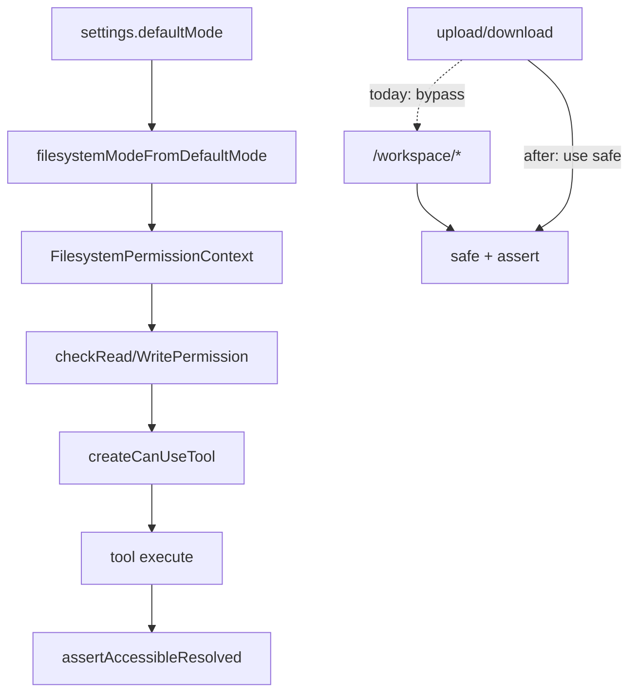

# 权限模块清理与重构（冗余 / 空壳 / 可改）

范围：`61482f8` 引入的 filesystem permissions，在命名统一（`5df8da1`）之后仍留下的**空实现、重复逻辑、不一致 API**。

**不做**：完整移植 CC `DANGEROUS_FILES` / UNC / `permissions.ask`（安全增强另开）。  
**会做**：upload/download 接到已有 `safe()`（现成闸门未用，属于漏接线，不是新功能）。

---

## 1. 删掉 / 收窄名存实亡的配置面

**问题**：Schema 与 `PERMISSION_DEFAULT_MODES` 暴露 `acceptEdits` / `plan`，`filesystemModeFromDefaultMode` 把它们都折成 `default`，注释却暗示有独立语义。

**改法（选定）**：
- Settings / 类型只保留真正生效的三种：`default` | `dontAsk` | `bypassPermissions`。
- 从 Zod enum、`PERMISSION_DEFAULT_MODES`、example settings、相关测试里去掉 `acceptEdits` / `plan`（若已有用户配置含这两个值：解析时 **coerce → `default`** 并打一次 warn，避免炸校验）。
- Agent / Ask / Plan 产品模式继续由现有 agents picker 管，不经由 filesystem `defaultMode`。

涉及：`src/core/settings-schema.ts`、`src/utils/permissions/filesystem.ts`、`.ai-agent/settings.example.json`、`src/scripts/test-settings-validation.ts`、`src/scripts/test-filesystem-permissions.ts`。

---

## 2. 去掉重复 / 死代码路径

| 项 | 现状 | 处理 |
|----|------|------|
| `can-use-tool` 里 ask 之后的 `bypassPermissions` 分支 | `checkWrite/Read` 已在 ask 前 allow；该分支对 File 工具基本不可达 | 删除 |
| 六个 File 工具 execute 里 `assertAccessibleResolved` + `policyFromContext` | Desktop `mode=default` 时 `assertAccessible` **直接 return**，调用是空转 | 抽 `enforcePermissionAtExecute(...)`：始终对 **deny** 抛错；`dontAsk` 对 ask 也抛错；`default` 仅拒绝 deny（用户刚 Allow 的 outside 放行）。去掉各工具重复样板 |
| `SANDBOX_EXTRA_READ_ROOTS` 环境名 | 旧 sandbox 词汇残留 | 保留读取兼容；注释标明 deprecated，代码不再称 sandbox |
| ACP `allow-always` 的 `kind: 'allow_once'` | `permission-bridge.ts` 元数据错误 | 改为与 always 语义一致（若 SDK 无单独 kind，与 optionId 对齐并注释） |

---

## 3. 规则匹配重构（逻辑 bug + 冗余计算）

**3a. allow / deny 相对根统一**  
`deniedByRule` 用全部 `workingDirectories`；`allowedByRule` 只用 `[ctx.root]`。  
→ 两边都用 `ruleRelativeRoots(ctx)`。

**3b. `/pattern` 锚定（与 CC 一致）**  
`permission-rules.ts` 把 leading `/` 当系统绝对路径。  
→ 单斜杠相对 **project root**；`~/`、盘符、`//` 仍为绝对。补单测。

**3c. 少算几遍路径**  
`checkRead/Write` 里多次 `getPathsForPermissionCheck`。  
→ 算一次 `pathsToCheck` 往下传。

**3d. `ignore()` 实例**  
每次 `ignore().add(pat)`。  
→ 按 pattern 缓存，或同一规则列表批量 `add`。

---

## 4. HTTP：接上已有 `safe()`，删掉「半套边界」

`router.ts` upload/download 不走 `safe()`，同一模块两套路径策略。  
→ 目标路径经 `safe(..., 'write'|'read')`；必要时给 transfer 注入 `resolveSafe` 回调。  
补测试：pinned/`dontAsk` 下绝对路径逃逸应 403。

---

## 5. UI 小清理

`CanUseToolCard.jsx`：
- 副标题写死 “Outside the workspace” → 改为用 description，或仅 outside 时显示。
- Always allow 成功态 hint 显示文件路径，实际授权的是目录 → hint 显示 granted **directory**。

---

## 6. 验证

- `npx tsx src/scripts/test-filesystem-permissions.ts`（扩展：allow/deny 同根、`/src/**` 锚定、upload safe）
- `test-settings-validation`（旧 `acceptEdits` coerce）
- 确认越界 Ask / Always / Reject 未回归

---

## 明确不做

- 移植 CC `DANGEROUS_FILES` / Windows UNC 全套
- 新增 `permissions.ask`
- edit-implies-read（默认不做）
- 改 `AUTH_ENABLED` / SSO 认证栈

---

## Todos

1. 收窄 defaultMode：去掉空壳 acceptEdits/plan（coerce+warn）；同步 schema/example/tests
2. 删 can-use-tool 死 bypass 分支；统一 execute 闸门；修 ACP kind；env 命名注释
3. 统一 allow/deny roots；/pattern 锚定；pathsToCheck 一次；ignore 缓存
4. upload/download 走 safe()；补逃逸测试
5. CanUseToolCard 去掉误导副标题；Always allow hint 显示目录
6. 跑测试并确认 Ask UI 未回归
