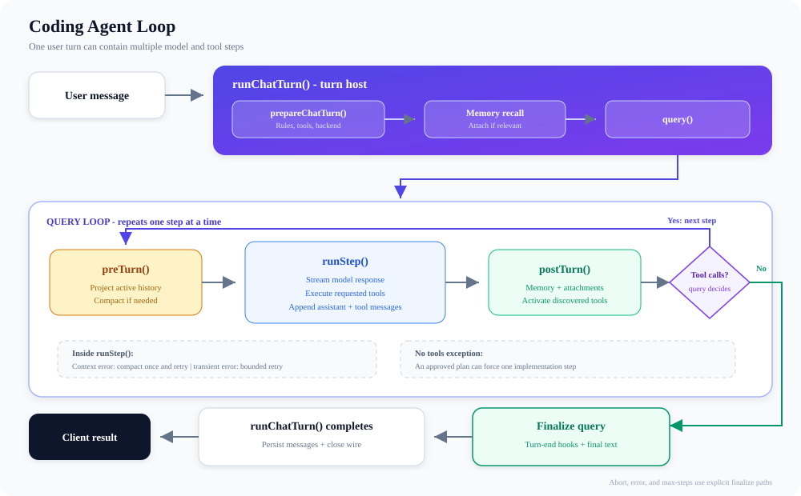
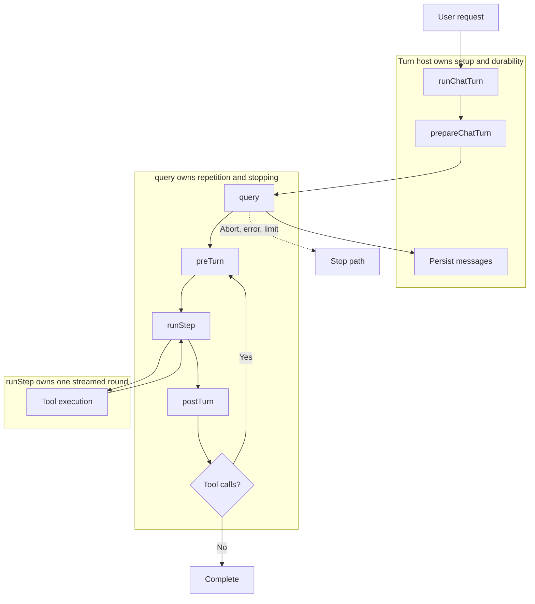
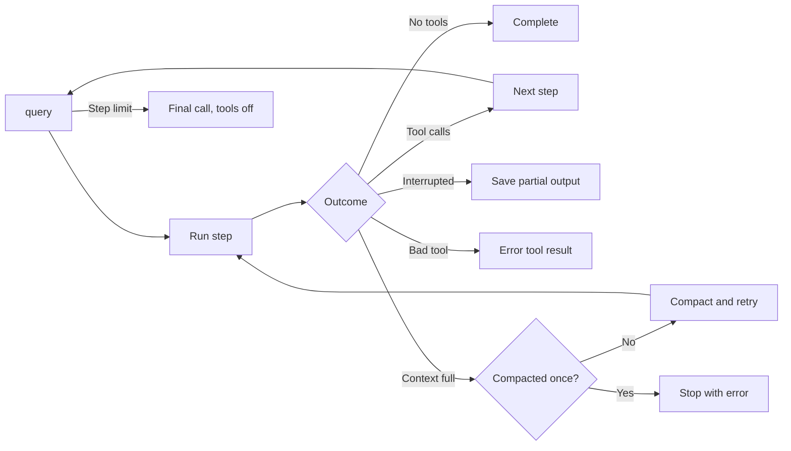

# Agent Loop

## Overview

The agent is not one model call. A turn host prepares the request, then
`query()` repeats model steps until application code decides to stop.
`runStep()` streams one model response and can start tools before that response
has fully arrived.

The compact view shows the repetition. The next diagram assigns each part of
that repetition to its owner.

## At a glance: ownership and flow

- `runChatTurn()` owns turn-scoped settings, middleware, abort propagation,
  memory side paths, wire completion, backend disposal, and final persistence.
- `prepareChatTurn()` resolves slash commands, rules, plugins, skills, MCP,
  permissions, execution, and the active/deferred tool pool.
- `query()` owns the loop counter, active tool set, lifecycle calls, and stop
  reason. The model proposes calls; it does not control continuation.
- `preTurn()` creates the active model view and compacts when needed. The full
  session transcript remains separate from this projected API view.
- `runStep()` normalizes the API messages, calls `streamText()`, executes tools,
  and appends assistant and tool messages to history.
- `postTurn()` consumes ready memory attachments, emits lifecycle snapshots,
  activates discovered tools, and adds generated attachments.

## One step, then the next

1. `preTurn()` starts from messages after the latest compact boundary, applies
   micro-compaction projection, and runs configured compaction.
2. `runStep()` projects messages for the provider and starts the lazy
   `streamText()` request.
3. `consumeStream()` forwards model events. `StreamingToolExecutor` queues each
   tool call as it appears and runs calls concurrently only when policy marks
   them safe.
4. `runStep()` waits for remaining tool results, then appends assistant, tool,
   and follow-up messages to the complete history.
5. `postTurn()` performs after-step work. If the step contained tool calls,
   `query()` loops; otherwise it completes.
6. After an approved plan, a no-tool response may be overridden once with a
   reminder that forces an implementation step.

## Failure boundaries

- Invalid or unavailable tool names become tool results with `isError: true`;
  they do not crash the loop.
- An interrupted stream commits usable partial output and records the
  interruption. The turn then stops as `aborted`.
- A failing Bash tool can cancel queued or parallel sibling calls so they do not
  continue after a broken prerequisite.
- A context-length failure receives one reactive compaction retry. Transient
  stream failures use limited backoff retries.
- When configured `maxSteps` is reached, the agent requests one final answer
  with tools disabled. If that fails, the wire reports the limit.
- Turn-end memory extraction runs only for `completed` and `max_steps`, not for
  cancelled or error turns.

## Source map

- Turn ownership and persistence: `src/turn/run-chat-turn.ts`
- Per-turn preparation: `src/utils/processUserInput/prepare_chat_turn.ts`
- Loop, continuation, and stopping: `src/core/query.ts`
- Active history and compaction: `src/core/query/pre-turn.ts`
- One streamed round: `src/core/query/run-step.ts`
- After-step hooks and discovery: `src/core/query/post-turn.ts`
- Stream consumption: `src/core/agent/streamConsumer.ts`
- Tool queue and concurrency: `src/services/tools/StreamingToolExecutor.ts`
- Forced final response: `src/core/query/force-final-answer.ts`

Last verified: 2026-09-13
