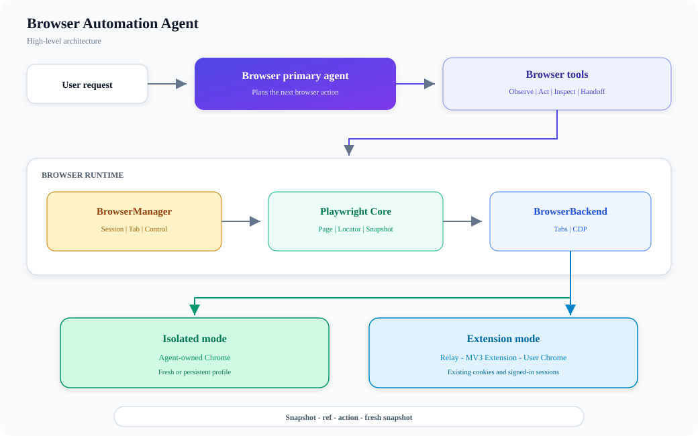
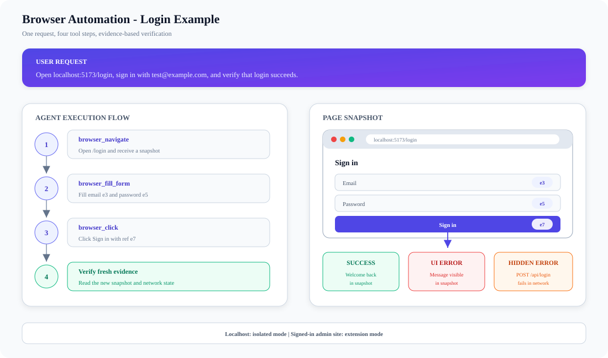
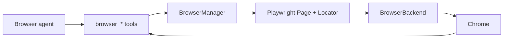

# Browser Automation

## Overview

The Browser primary agent observes a page, chooses a `browser_*` tool, performs
an action, and observes the result again.



Two browser modes use the same tools:

- **Isolated mode:** a separate, agent-owned Chrome profile.
- **Extension mode:** the user's Chrome, including existing cookies and
  signed-in sessions.

## Example: verify a login flow

The user gives the agent one request:

> Open `http://localhost:5173/login`, sign in with
> `test@example.com / password123`, and verify that login succeeds.



### 1. Navigate and observe

`browser_navigate` opens the page and returns its first snapshot:

```yaml
- heading "Sign in"
- textbox "Email" [ref=e3]
- textbox "Password" [ref=e5]
- button "Sign in" [ref=e7]
```

### 2. Fill and submit

The agent selects the form and click tools using those refs:

```text
browser_fill_form({
  fields: [
    { ref: "e3", value: "test@example.com" },
    { ref: "e5", value: "password123" }
  ]
})
browser_click({ ref: "e7" })
```

### 3. Verify the result

The click returns a new snapshot. A successful result might contain:

```yaml
- heading "Welcome back"
```

Verification is more than checking whether the click completed:

- **Success:** the new snapshot contains `heading "Welcome back"`.
- **Visible failure:** the snapshot contains an error message.
- **Hidden failure:** `browser_network` reports a failed `POST /api/login` even
  when the page displays no error.

Localhost normally works with isolated mode and no pairing. A signed-in admin
site usually needs extension mode. Refs belong to the latest snapshot, so the
agent must use fresh refs after the page changes.

## What happens inside



- **BrowserManager** owns the session's browser, current tab, control state, and
  idle cleanup.
- **Playwright** turns snapshot refs into reliable page actions.
- **BrowserBackend** provides tabs and CDP for isolated or extension Chrome.
- **Browser tools** enforce timeouts, handoff rules, and bounded results.

## Important boundaries

- `browser_lock` switches control between the user and the agent.
- Snapshot refs can become stale after navigation or DOM updates.
- Screenshots show pixels; snapshots provide elements the agent can act on.
- Large snapshots are stored as files and replaced with a bounded preview.
- Raw `browser_cdp` is restricted; normal input should use dedicated tools.

## Source map

- Agent profile: `.ai-agent/agents/browser.md`
- Tool definitions: `src/tools/BrowserTool/BrowserTool.ts`
- Browser lifecycle: `src/browser/manager.ts`
- Page and locator operations: `src/browser/playwright/`
- Backends: `src/browser/backends/`
- Extension relay: `src/browser/relay/`

Last verified: 2026-09-13
