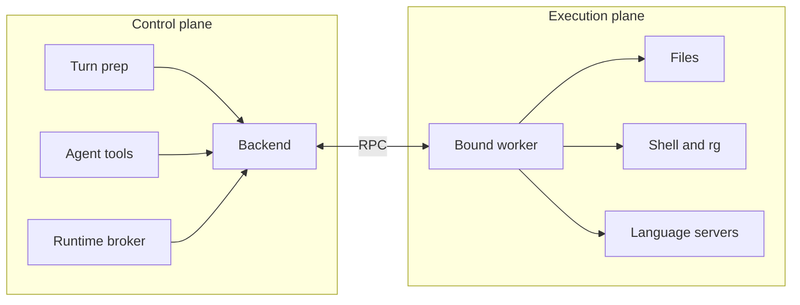
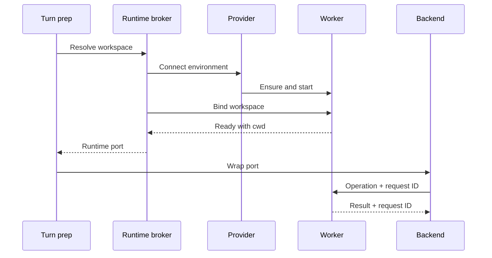
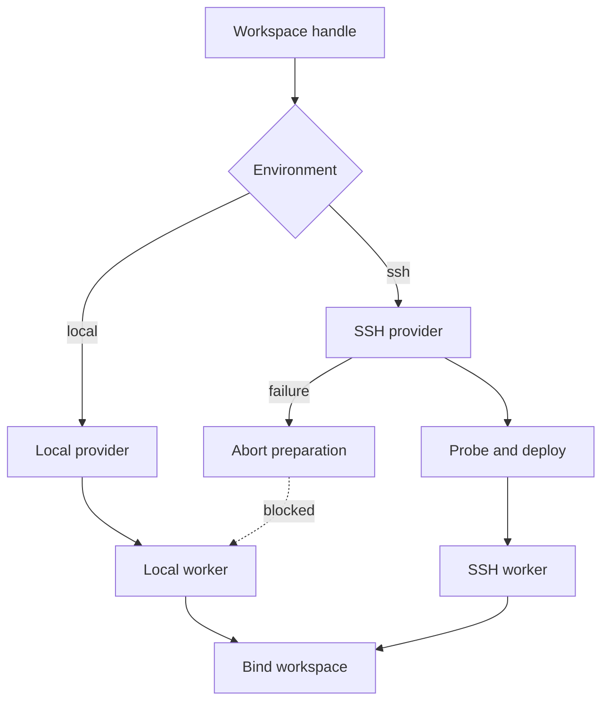

# Execution Plane

## Overview

The execution architecture keeps agent orchestration on the control machine and workspace operations beside the workspace. Tools use one `ExecutionBackend`; brokers connect that contract to a local or SSH worker.

## At a glance



- The control plane owns sessions, models, orchestration, permissions, environment selection, and worker lifecycle.
- The worker owns filesystem, shell, ripgrep, background-process, and LSP operations.
- Local and SSH environments expose the same backend contract to tools.
- A workspace handle combines an environment ID with a path inside that environment.

```ts
{
  environmentId: 'local' | 'ssh:<host>',
  cwd: '/path/inside/that/environment'
}
```

## End-to-end request and data flow



`resolveExecutionBackend()` uses the session workspace, or a local default when no handle exists. `RuntimeBroker` caches healthy runtimes by `environmentId::cwd` and shares an in-progress open so concurrent callers do not create duplicate workers. It ensures the requested worker version, opens the runtime, and waits for binding before exposing the backend.

Binding sends the complete workspace handle. The worker resolves the path when possible, changes its process directory, configures LSP servers there, and replies `ready`. `WorkerExecutionBackend` then converts tool operations into request-correlated RPC. It also rejects file paths outside the bound workspace before sending file operations.



The dashed edge is deliberately blocked: an SSH failure must not redirect file or shell work to the control machine. Turn preparation throws with an explicit “cannot fall back” error. This guarantee is specific to remote workspaces. A local worker-resolution failure is logged and current preparation may continue with no worker-backed execution object.

For remote sessions, files, commands, search, and language servers operate in the SSH workspace. Plugins, skills, agents, MCP configuration, and settings still load from the control machine’s default workspace; project rules and auto-memory are not loaded from the remote tree.

## Responsibilities

- **Execution bootstrap:** registers local and SSH providers and creates credentials, runtime, workspace, and permission services.
- **Environment registry:** resolves environment input, selects a provider, and reuses active environment connections.
- **Runtime broker:** ensures worker availability and owns one healthy runtime per workspace key.
- **Providers:** start a local child process or probe SSH, deploy the worker, and open its stdio channel.
- **Workspace service:** performs browse-time filesystem work through the selected environment connection.
- **Worker backend:** enforces workspace paths and correlates filesystem and LSP requests.
- **Worker:** executes operations and hosts language servers next to the files.

## Failure boundaries

- SSH probe, deployment, connection, or bind failure aborts remote turn preparation; local execution is not substituted.
- Binding fails if the worker cannot change to the requested directory. Local binding waits up to 15 seconds; SSH binding waits up to 90 seconds.
- A dead cached runtime is closed and reopened. Concurrent opens for the same workspace share one promise.
- Filesystem and LSP failures return an error carrying the original request ID. Backend requests also time out if no matching result arrives.
- Worker interrupt is currently a no-op in worker v1; turn cancellation still stops control-plane orchestration.
- Background commands require explicit polling or termination. The worker force-kills unfinished children when it exits.
- Auth-proxy startup failure is logged and bootstrap continues. Deployments that depend on proxied credentials must treat that as degraded operation.
- Server shutdown closes all runtimes and then stops the credential proxy.

## Source map

- `src/execution/bootstrap.ts` — control-plane services
- `src/execution/environment-registry.ts` — provider and connection selection
- `src/execution/resolve-backend.ts` — session-to-backend resolution
- `src/execution/runtime-broker.ts` — worker reuse and lifecycle
- `src/execution/workspace-service.ts` — environment-aware browsing
- `src/execution/worker-execution-backend.ts` — tool-facing RPC backend
- `src/execution/runtime-protocol.ts` — worker message contract
- `src/execution/stdio-runtime-port.ts` — NDJSON runtime channel and binding
- `src/execution/providers/local/local-provider.ts` — local worker startup
- `src/execution/providers/ssh/ssh-provider.ts` — SSH connection and worker deployment
- `src/execution/providers/ssh/ssh-stdio-session.ts` — SSH runtime channel
- `src/utils/processUserInput/prepare_chat_turn.ts` — remote fallback boundary
- `src/worker/main.ts` — filesystem, shell, search, and bind handling
- `src/worker/lsp-host.ts` — worker-local language servers

Last verified: 2026-09-13
