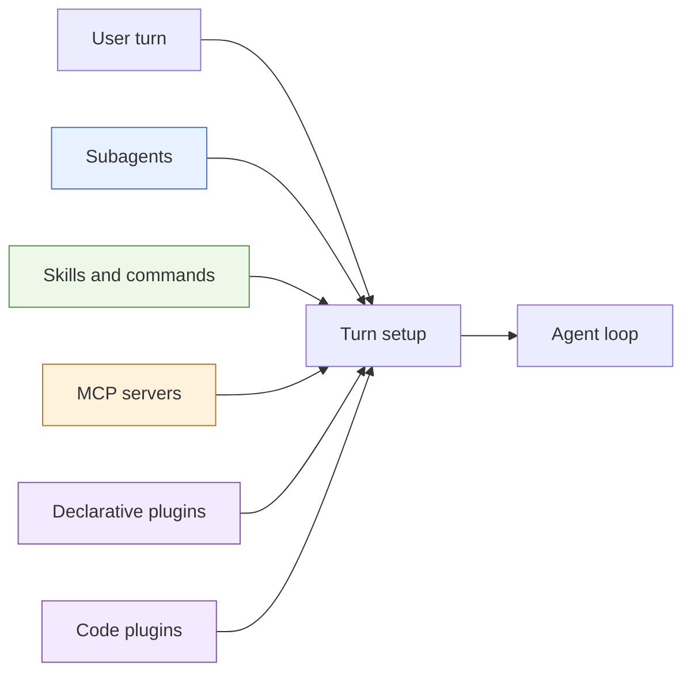
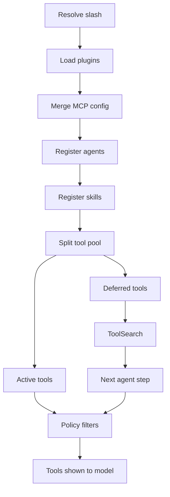
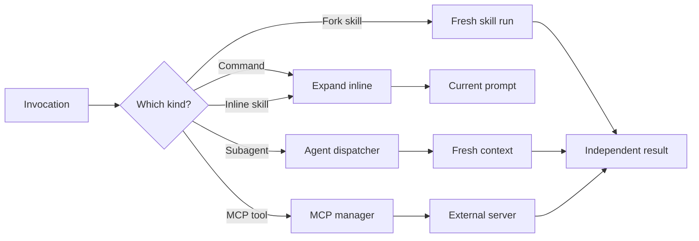

# Extension Architecture

## Overview

Extensions add specialized behavior without changing the core agent loop. Some provide instructions, some delegate work, and some add tools. The system discovers these contributions, combines them for the current turn, and then applies policy before the model can use them.

## At a glance

- **Subagents** run a separate agent with a selected prompt, model, and tool set.
- **Skills and commands** turn reusable Markdown instructions into a prompt or an independent skill run.
- **MCP** connects external servers and exposes their tools through the normal tool registry.
- **Declarative plugins** are folders that contribute agents, commands, skills, and MCP configuration.
- **Code plugins** are compiled objects that register tools, middleware, or event listeners at process boot.

These are different extension mechanisms. A declarative plugin is a package for the first four kinds of contribution; it is not the same runtime mechanism as a code plugin.

## Per-turn composition

Most extension choices are rebuilt for each user turn.

`prepareChatTurn()` first resolves slash syntax, then loads declarative plugins from the control workspace. Plugin MCP definitions are merged with settings, subagents and skills are registered, and the registry is split into active and deferred tools.

`ToolSearch` exposes names and short descriptions for deferred tools. A match makes the full tool definition available on a later agent step, reducing prompt size. The browser specialist is an exception: its browser tools are promoted immediately to avoid a discovery race.

Tool enablement, primary-agent allow/deny patterns, browser availability, scheduled-task settings, and permission mode are applied after composition. Ask mode does not expose `ToolSearch`; it promotes only approved read-only deferred tools.

Code plugins sit outside this per-turn discovery path. `initCodePlugins()` runs them once at boot. Their tool registrations remain in the global registry, while recorded middleware and event hooks are replayed in request contexts.

## Invocation lifecycle

The selected extension determines whether work stays in the current conversation.

Commands substitute arguments and expand inline shell/file directives before replacing the current user message. Skills lazily read `SKILL.md`, perform the same substitutions, and either expand inline or fork according to their configured context.

All subagent types share one `Agent` dispatcher. It validates `subagent_type`, selects the definition and model tier, creates a fresh message list and system prompt, removes disallowed tools and the `Agent` tool itself, then projects the nested run back into the parent tool call. A subagent does **not** inherit the parent transcript, so its dispatch prompt must be self-contained.

MCP managers are pooled by resolved working directory plus a stable hash of server configuration. They are reused across turns and closed after 30 minutes of inactivity; a settings write invalidates managers for that working directory.

## Responsibility boundaries

- **Turn preparation** discovers local contributions and decides what can participate now.
- **Registries** hold definitions; they do not decide permission or agent policy.
- **Tool-pool assembly** separates active from deferred tools, then filters both.
- **Dispatchers** expand commands/skills or start isolated subagent execution.
- **Plugin and MCP managers** own lifecycle: boot-time code hooks and pooled external connections respectively.

Remote execution is a deliberate split boundary: declarative plugins, skills, MCP settings, and subagent definitions come from the control machine's default workspace, while execution tools use the remote working directory. Project rules and automatic memory are not loaded from the remote tree in this path.

## Failure boundaries

- **Discovery:** malformed plugin manifests, skills, or MCP JSON are reported with their source. Other valid plugin contributions continue loading.
- **Naming:** project-scope declarative plugins shadow user plugins with the same name. Duplicate agent types fail explicitly; MCP name collisions are reported and the later contribution wins.
- **Dispatch:** an unknown `subagent_type` fails. Plan mode permits only explore and plan subagents. Missing context in a subagent prompt cannot be recovered from the parent transcript.
- **Deferred loading:** a deferred tool cannot be called until discovery has activated it on a later step. Ask mode withholds mutating and MCP deferred tools.
- **External lifecycle:** an unavailable MCP server can leave its tools absent. Configuration changes replace the pooled manager rather than mutating a live connection.
- **Boot lifecycle:** one code plugin can enter an error state without preventing later plugins from initializing. Code-plugin changes require a process restart.
- **Remote scope:** extensions on the control workspace may differ from files visible in the remote project.

## Source map

- Turn composition and remote/control-workspace split: `src/utils/processUserInput/prepare_chat_turn.ts`
- Active, deferred, and policy filtering: `src/tools/assembleToolPool.ts`
- Subagent registration and dispatch: `src/tools/AgentTool/`
- Skill loading and expansion: `src/skills/`
- Slash lookup and dispatch: `src/commands/`
- Deferred discovery: `src/tools/ToolSearchTool/ToolSearchTool.ts`
- Declarative plugin loading: `src/core/plugins/loader.ts`
- Code-plugin boot lifecycle: `src/core/plugins/index.ts`, `src/core/plugins/code-plugins.ts`, `src/core/plugin-manager.ts`
- MCP connections and pooling: `src/core/mcp-manager.ts`, `src/core/mcp-lifecycle.ts`

Last verified: 2026-09-13
