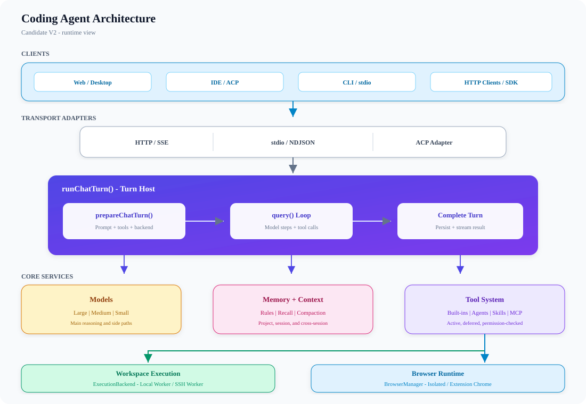
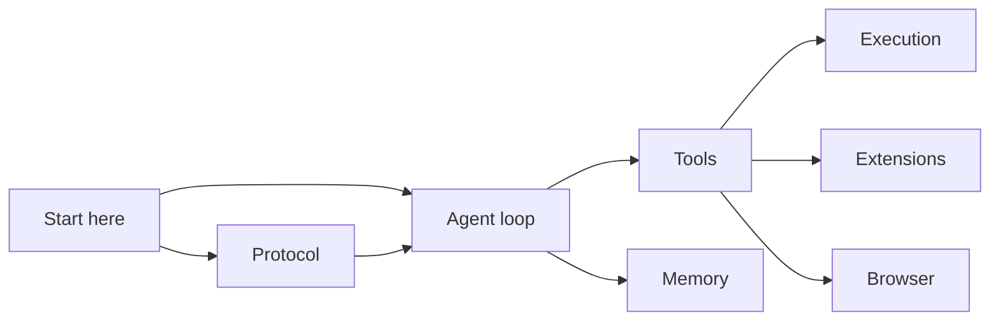
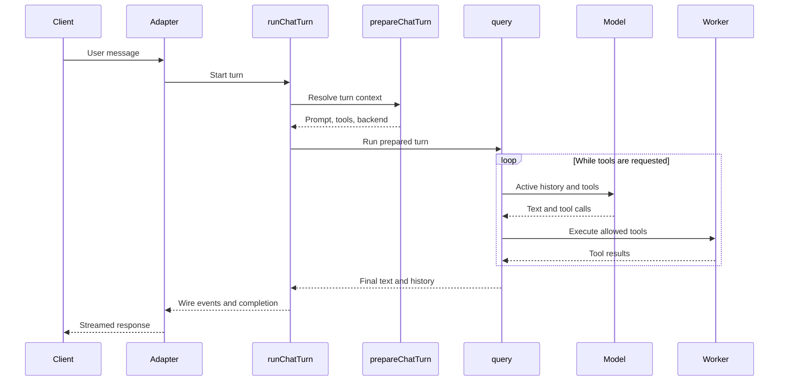

# Architecture

## Overview

Every interface uses the same agent engine. An adapter turns client input into a
turn, `runChatTurn()` prepares that turn, and `query()` alternates between the
model and tools. The client receives progress events while the session keeps the
durable conversation history.

The large view separates interfaces, the core engine, models, and execution
environments. The diagrams below zoom in on the documentation and one request.

## At a glance

- [Agent loop](./agent-loop.md) — how one turn becomes repeated model steps
- [Protocol](./protocol.md) — messages shared by clients and the engine
- [Tools](./tools.md) — selection, permission checks, and execution
- [Memory](./memory.md) — rules, recall, history projection, and compaction
- [Execution](./execution.md) — local and SSH-backed workspaces
- [Extensions](./extensions.md) — agents, skills, commands, MCP, and plugins
- [Browser](./browser.md) — browser backends, actions, and handoff

Read **Agent loop** first. Follow **Tools → Execution** to learn where actions
run, or **Protocol → Agent loop** to learn how a client drives a turn.

## One message end to end

1. `src/entrypoints/cli.ts` selects HTTP, stdio, ACP, or worker mode.
2. The selected adapter calls the transport-independent `runChatTurn()`.
3. `prepareChatTurn()` loads rules and extensions, builds the permitted tool
   pool, and resolves a local or remote execution backend.
4. `query()` owns continuation: model output may trigger tools and another step.
5. `runChatTurn()` persists new session messages after the loop has updated
   history. Wire events are the live client view, not the persistence layer.

## Responsibilities

- **Adapters:** translate HTTP, stdio, or ACP traffic; they do not implement the
  agent loop.
- **Turn host:** owns settings, abort wiring, preparation, memory side paths,
  transport completion, and persistence.
- **Query loop:** owns model steps, tool-result feedback, and stop decisions.
- **Execution plane:** gives tools a workspace backend. Local and SSH providers
  expose the same role, but do not share a workspace.
- **Protocol:** Zod schemas in `protocol/src/` define the engine/client contract.

## Failure boundaries

- A disconnect or external abort propagates through the turn to model and tool
  execution; usable partial output can still be recorded.
- Remote backend resolution fails closed. It must not run file or shell tools on
  the control machine when the requested remote workspace is unavailable.
- A context-length error gets one reactive compaction attempt. Transient model
  stream failures use bounded retries.
- One session admits only one active turn, avoiding concurrent mutation of the
  same transcript.

## Source map

- Entrypoint selection: `src/entrypoints/cli.ts`
- Shared turn host and persistence: `src/turn/run-chat-turn.ts`
- Per-turn composition: `src/utils/processUserInput/prepare_chat_turn.ts`
- Loop and stopping: `src/core/query.ts`
- Tool pool construction: `src/tools/assembleToolPool.ts`
- Execution-plane services: `src/execution/bootstrap.ts`
- Wire schemas: `protocol/src/`

Last verified: 2026-09-13
