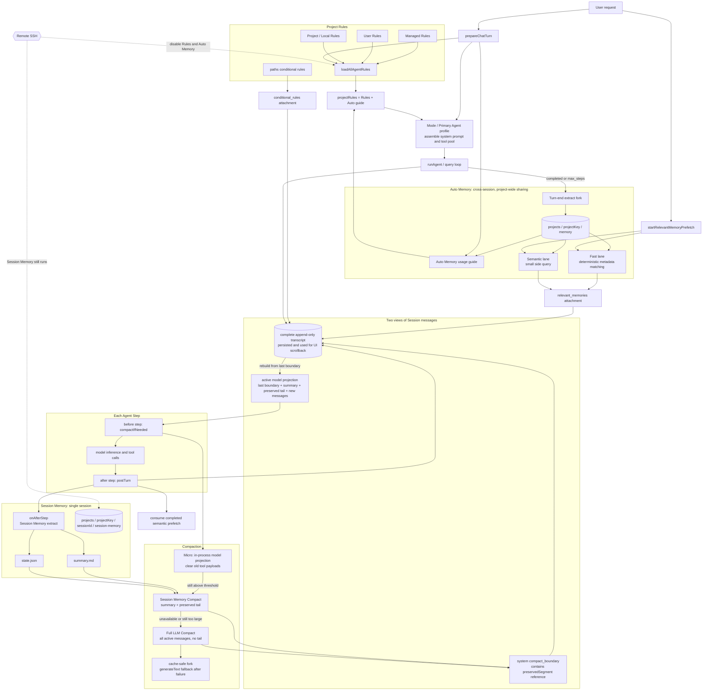

# Coding Agent Memory System Development Guide

> This document describes the current implementation under `src/` in this repository. It was last verified on 2026-09-13.
> Here, “memory” includes Project Rules, Auto Memory, Session Memory, and Compaction. These are not four names for one feature; they are four layers with different lifecycles, storage locations, and consumers.

## 1. Key conclusions

The current runtime memory architecture has only four layers:

1. **Project Rules**: manually maintained long-term rules, reloaded during every turn preparation.
2. **Auto Memory**: cross-session topic memories shared by all Primary Agents in the same project.
3. **Session Memory**: a progress ledger for one session, consumed primarily by Compaction.
4. **Compaction**: cleans or summarizes historical messages when the context approaches its limit.

There is currently no Persistent Agent Memory isolated by custom Agent:

- `AgentDefinition` no longer declares `memory: user | project | local`.
- Agent markdown frontmatter does not parse `memory:`.
- Browser Primary and General Primary use the same project Auto Memory directory.
- Subagents do not receive independent persistent memory directories.
- The original `src/tools/AgentTool/agentMemory.ts` and its corresponding tests have been deleted; the module with the same name in the Claude Code reference documentation exists only for comparison with the upstream design.

Auto Memory topic frontmatter currently contains only `name`, `description`, and `type`. There is no source field such as `source: browser`, nor is there an implementation that filters by source.

## 2. Overall architecture



Do not confuse the two dynamic attachment channels in the diagram with the system prompt:

- `relevant_memories` comes from Auto Memory prefetch.
- `conditional_rules` comes from rules with `paths:` frontmatter and is injected after a tool successfully reads or writes a matching file.

The same session has two message views with different purposes: JSONL and the UI retain the complete append-only transcript; the model, token calculations, and Session Memory consume only the active model projection rebuilt after the last `compact_boundary`.

For a chronological view of how the four memory layers operate after a new message arrives, see [§3.0](#30-end-to-end-memory-flow-after-a-new-message-arrives).
For a simplified demonstration diagram, see [memory-flow-simplified.svg](./assets/memory-flow-simplified.svg).

## 3. Sequence of a complete turn

### 3.0 End-to-end memory flow after a new message arrives

The following diagram traces the chronological path from a new user message through the end-of-turn write-back. It marks when each of the four memory layers is read and written.

```mermaid
flowchart TD
  MSG["New user message enters session<br/>append to complete transcript"]

  MSG --> PREP

  subgraph P1["① Turn preparation · prepareChatTurn"]
    PREP["prepareChatTurn"]
    PREP --> RULES["loadAllAgentRules<br/>Managed → User → Project/Local"]
    PREP --> GUIDE["buildAutoMemorySystemAppend<br/>inject usage guide only by default<br/>include MEMORY.md when prefetch is disabled"]
    RULES --> MERGE["projectRules = Rules + Auto guide"]
    GUIDE --> MERGE
    MERGE --> PROMPT{"omitProjectRules?"}
    PROMPT -->|"no"| SYS["system prompt includes projectRules"]
    PROMPT -->|"yes · Browser/Plan/Explore"| SYS2["system prompt excludes Rules / Auto guide"]
    PREP --> ROOTS["add memdir to extraRead/WriteRoots<br/>Primary Agent can write topic files directly"]
  end

  SYS --> LOOP0
  SYS2 --> LOOP0
  ROOTS --> LOOP0

  subgraph P2["② Before the main loop · run-chat-turn"]
    LOOP0["user message is already in session"]
    LOOP0 --> REMOTE{"Remote SSH?"}
    REMOTE -->|"yes"| AM_OFF["disable Rules injection and Auto Memory<br/>neither prefetch nor extract runs"]
    REMOTE -->|"no"| HOOKS["create memory lifecycle hooks<br/>onAfterStep → Session Memory<br/>onTurnEnd → Auto Memory"]
    HOOKS --> PREFETCH{"autoMemory + prefetch<br/>enabled?"}
    PREFETCH -->|"no"| STEP0
    PREFETCH -->|"yes"| START["startRelevantMemoryPrefetch"]
    START --> FAST["Fast lane: scan filename/name/description"]
    FAST --> STRONG{"strong fast hit?"}
    STRONG -->|"yes"| ATT_FAST["immediately inject relevant_memories<br/>skip semantic"]
    STRONG -->|"no"| INTENT{"explicit recall intent?<br/>remember / last time / previously…"}
    INTENT -->|"yes"| WAIT["wait up to 4s for semantic"]
    INTENT -->|"no"| ASYNC["run semantic asynchronously<br/>do not wait"]
    WAIT --> ATT_SEM["inject relevant_memories if completed<br/>timeout does not cancel; attach later"]
    ATT_FAST --> STEP0
    ATT_SEM --> STEP0
    ASYNC --> STEP0
    AM_OFF --> STEP0
  end

  subgraph P3["③ Each Agent Step · query loop"]
    STEP0["start step N"]
    STEP0 --> ACTIVE["getActiveModelMessages<br/>last compact_boundary + Micro projection"]
    ACTIVE --> COMPACT["compactIfNeeded"]

    COMPACT --> MICRO["Micro: clear old tool payloads<br/>modify only in-process projection, not JSONL"]
    MICRO --> NEED{"still above auto-compact threshold?"}
    NEED -->|"no"| MODEL
    NEED -->|"yes"| SM_OK{"Session Memory<br/>available and trustworthy?"}
    SM_OK -->|"yes"| SMC["SM Compact<br/>summary.md + preserved tail"]
    SM_OK -->|"no"| FULL["Full LLM Compact"]
    SMC --> STILL{"still too large after construction?"}
    STILL -->|"yes"| FULL
    STILL -->|"no"| BOUNDARY
    FULL --> BOUNDARY["append compact_boundary<br/>+ summary + attachments to transcript"]
    BOUNDARY --> MODEL

    MODEL["model inference + tool calls"]
    MODEL --> TOOLS{"tool successfully reads/writes<br/>a file matching paths:?"}
    TOOLS -->|"yes"| CRULE["inject conditional_rules attachment"]
    TOOLS -->|"no"| POST
    CRULE --> POST

    POST["postTurn"]
    POST --> LATE["consumeMemoryPrefetchIfReady<br/>late attach if semantic completed"]
    LATE --> SMEX["onAfterStep → Session Memory extract<br/>async · forks only at token/tool threshold"]
    SMEX --> SMWRITE["write summary.md + state.json<br/>serialized per session · latest-wins"]
    SMWRITE --> MORE{"another step?"}
    MORE -->|"yes"| STEP0
    MORE -->|"no"| END_TURN
  end

  subgraph P4["④ End of turn"]
    END_TURN["emitTurnEnd"]
    END_TURN --> REASON{"reason?"}
    REASON -->|"completed / max_steps"| AMEX["onTurnEnd → Auto Memory extract"]
    REASON -->|"aborted / error"| SKIP["do not extract · cursor remains in place"]
    AMEX --> WROTE{"was memdir written directly<br/>and successfully this turn?"}
    WROTE -->|"yes"| SKIP_EX["skip extract · repair frontmatter only"]
    WROTE -->|"no"| FORK["extract fork ≤5 steps<br/>Write/Edit restricted to memdir"]
    FORK --> TOPICS["write/update topic .md files<br/>prefetch mode does not maintain MEMORY.md index"]
    SKIP_EX --> DONE
    TOPICS --> DONE["finish turn · dispose prefetch"]
    SKIP --> DONE
  end
```



Read paths versus write paths (interleaved within the same turn):

| Timing | Read / inject | Write / update |
| --- | --- | --- |
| preparation | Rules + Auto guide enter system prompt | — |
| before step 0 | fast / explicit-recall `relevant_memories` | — |
| before each step | run Micro / SM / Full compact on the active model projection | append `compact_boundary` when SM/Full succeeds |
| after tools | inject `conditional_rules` for matching files | Primary Agent may write memdir topic files directly |
| after each step | late semantic attachment | Session Memory → `summary.md` |
| successful turn end | — | Auto Memory extract → topic `.md` files |

### 3.1 Turn preparation

`src/utils/processUserInput/prepare_chat_turn.ts` is responsible for:

1. Parsing slash commands.
2. Loading plugins, skills, subagents, and MCP.
3. Calling `loadAllAgentRules(cwd)` for local sessions.
4. Resolving Auto Memory configuration and calling `buildAutoMemorySystemAppend()`.
5. Combining rules and the Auto Memory guide into one `projectRules` string.
6. Resolving the Primary Agent profile and assembling the tool pool.
7. Adding the Auto Memory directory to `extraReadRoots` and `extraWriteRoots`.

`resolveTurnSystemPrompt()` then selects the default mode prompt or the Primary Agent prompt.

### 3.2 Before the main loop

After the user message has entered the session, `src/turn/run-chat-turn.ts`:

1. Creates Session Memory and Auto Memory lifecycle hooks.
2. Starts Auto Memory fast / semantic prefetch.
3. Consumes a strong fast hit first.
4. Waits up to four seconds for the semantic lane if the user explicitly asks to recall previous content.
5. Inserts successfully recalled content into the message stream as a `relevant_memories` meta attachment.

### 3.3 Each step

The step machine in `src/core/query.ts` runs in this order:

1. `preTurn` calls `compactIfNeeded()`.
2. The model performs inference and executes tools.
3. `postTurn` consumes semantic prefetch that has completed but has not yet been injected.
4. `onAfterStep` asynchronously triggers Session Memory extraction.

### 3.4 End of the entire turn

`emitTurnEnd()` calls `onTurnEnd` only for `completed` or `max_steps`, asynchronously triggering Auto Memory extraction.

`aborted` and `error` do not trigger Auto Memory extraction for that turn; the cursor remains in place so a later successful turn can cover the complete range.

## 4. Project Rules

Project Rules are manually specified behavior, not facts learned automatically by the model.

### 4.1 Load order

`loadAllAgentRules()` in `src/utils/rules-loader.ts` merges rules in this order:

1. Managed policy rules.
2. User rules.
3. Project and local rules.

Project rules are searched from `cwd` toward the git root. Directories closer to `cwd` appear later and have higher priority. Within the same directory, the order is:

1. Root-level `AGENTS.md`.
2. `{appDir}/AGENTS.md`, where the default is `.ai-agent/AGENTS.md`.
3. `{appDir}/rules/**/*.md`.
4. `{appDir}/AGENTS.local.md`.
5. Root-level `AGENTS.local.md`.

Rules support a standalone `@relative/path` text include, recursively up to five levels. Individual files and the merged result each have an approximately 40 KiB limit.

### 4.2 Conditional rules

Files under `.ai-agent/rules/*.md` with `paths:` frontmatter are not included in the static system prompt.

After a tool successfully reads or writes a matching file, `loadConditionalRulesForPaths()` wraps the rule as a `conditional_rules` attachment. This consumes context only while handling relevant paths.

Conditional rules are also disabled for Remote sessions or when a Primary Agent sets `omitProjectRules: true`.

### 4.3 Appropriate content

- Build, test, and formatting commands.
- Stable coding conventions and non-negotiable security constraints.
- Required repository workflows.
- Long-term project constraints that the model must not infer on its own.

Put temporary progress in Session Memory; put cross-session preferences and non-code facts in Auto Memory.

## 5. Auto Memory

Auto Memory is a project-wide collection of cross-session topic files shared by all Primary Agents.

### 5.1 Default storage path

```text
{agentHome}/.ai-agent/projects/{projectKey}/memory/
├── MEMORY.md
├── <topic-a>.md
└── <topic-b>.md
```

For local workspaces, `projectKey` is derived from the canonical git root; worktrees are normalized to the main repository. Non-git workspaces use the normalized `cwd`, processed by `sanitizePath()`.

`autoMemory.directory` / `autoMemoryDirectory` can override the default directory, but only **user** settings (and managed / policy settings) are trusted. Directory overrides in **project** and **local** (`settings.local.json`) settings are removed by `stripUntrustedAutoMemoryDirectory()`, preventing a repository or shareable local configuration from turning an arbitrary system path into an allowlisted read/write location. Other Auto Memory switches, such as `enabled` and `prefetchEnabled`, can still be set by project / local configuration.

In SSO mode, an override path must also be inside the current tenant's `agentHome`.

Topic scans skip `team/`, `logs/`, and directories whose names begin with `_` (for example, `_backup_*`), and retain at most 200 topic files.

### 5.2 Topic file format and four types

```markdown
---
name: concise-memory-name
description: one specific line used for future relevance selection
type: user
---

Memory body
```

Allowed `type` values:

- `user`: the user's role, knowledge background, responsibilities, and stable collaboration preferences.
- `feedback`: a working method the user corrected or confirmed, emphasizing “what to do in the future.”
- `project`: project context, motivation, deadlines, or organizational facts that cannot be derived from the current code or git history.
- `reference`: where information resides in an external system, such as a Linear project, Slack channel, or monitoring dashboard.

When classifying, preserve the most direct meaning. “List failures first in future reports” should usually be `feedback`; consider `user` only if it also constitutes a stable user-level communication preference. Do not mechanically write both copies.

Do not store:

- Content directly available from current code, directories, or configuration.
- History already answerable through git log / blame.
- Rules already written in AGENTS.md.
- Temporary state for the current task.
- Credentials, cookies, tokens, or personal form data.
- Temporary selectors, tab refs, element refs, or one-time page state.

Memories expire. Before using a file path, function name, switch, or current project state, verify it against the current code or an authoritative external source.

### 5.3 System prompt injection

By default, `buildAutoMemorySystemAppend()` injects only behavioral guidance describing how to use Auto Memory. It does not insert the entire memory store or the body of `MEMORY.md` into the system prompt.

With the default `prefetchEnabled: true`:

- The guide does not require maintenance of a `MEMORY.md` index.
- Relevant topic bodies enter context through prefetch attachments.

`prefetchEnabled: false` is compatibility mode:

- Per-turn relevance selection does not run.
- The system prompt includes a truncated `MEMORY.md`.
- The index is maintained after writes or extraction.
- The index is limited to 200 lines and 25 KiB.

### 5.4 Recall: Fast lane

`findFastRelevantMemories()` checks only metadata such as filename, name, and description without first reading every body.

The following are strong hits:

- An exact phrase match between the query and the filename, stem, or name.
- The top score is at least `0.82` and leads the second score by at least `0.12`.

A strong fast hit returns at most three entries and is injected immediately before step 0.

### 5.5 Recall: Semantic lane and four-second explicit wait

The Semantic lane uses a side query with `prefetchModelTier: small` to select at most five entries from the candidate manifest.

A strong fast hit also skips the Semantic lane, so only fast results are injected for that turn. A normal request that starts the Semantic lane does not wait for it before step 0; a later `postTurn` injects the result after it completes. When the user explicitly asks for historical content with phrases such as “last time,” “what did we discuss before,” or “do you remember,” `consumeMemoryPrefetchWithTimeout()` waits up to the following limit before step 0:

```ts
EXPLICIT_RECALL_TIMEOUT_MS = 4_000
```

If it completes within four seconds, the result is injected immediately. A timeout neither cancels the task nor marks it as consumed. When the result completes later, it can still be attached after a subsequent step.

If there is no strong fast hit and the query contains no spaces and is shorter than 10 characters, the Semantic lane is skipped (and if fast also has no result, the entire prefetch ends immediately); short filenames and short CJK queries still pass through the Fast lane first. Paths already surfaced in `relevant_memories` in this session, and paths in the current `readFileState`, are not surfaced again.

Each automatically injected entry is limited to 200 lines or 4096 bytes. After the cumulative memory bodies surfaced in one session reach 60 KiB, no new prefetch is started.

### 5.6 Two write paths

Direct writes by the Primary Agent:

- `prepareChatTurn` adds memdir to the additional read/write roots.
- The Agent can create or update topic files through Write / Edit.
- Default prefetch mode requires only writing topic files; `MEMORY.md` does not need to be updated.
- If memdir was successfully written directly during the turn, turn-end extract is skipped to avoid duplication.

Turn-end side-query extraction:

- Every eligible turn is checked by default. `extractEveryNTurns` is currently hardcoded to 1 and is not yet exposed in settings.
- The extract fork runs at most five steps.
- Read / Grep / Glob can access the workspace and memdir; Write / Edit can modify only memdir.
- With `cacheSafe: true`, it reuses the main-loop model and prompt-cache shape.
- With `cacheSafe: false`, it uses a separate `modelTier`, which defaults to medium.
- Tasks for the same memdir are serialized; automatic pending tasks use latest-wins coalescing.

After writing, only the frontmatter of files written in that operation is repaired. The repair logic can correct indentation and values that require quoting, but it does not guess a missing `type`.

The Auto Memory extraction cursor exists only in process memory and resets after a process restart; it differs from Session Memory's persistent `state.json`.

## 6. Session Memory

Session Memory is a work-progress ledger for a single session. Its primary consumer is Session Memory Compact.

### 6.1 Storage path

```text
{agentHome}/.ai-agent/projects/{projectKey}/{sessionId}/session-memory/
├── summary.md
└── state.json
```

This is not `.sessions/{sessionId}/...` from the old documentation.

Local sessions use the same project-bucket rules as Auto Memory. Remote SSH uses `sanitize(environmentId:cwd)` as `projectKey`, preventing different remote environments from being mixed.

### 6.2 [summary.md](http://summary.md)

The default template always contains 10 sections:

1. Session Title
2. Current State
3. Task specification
4. Files and Functions
5. Workflow
6. Errors & Corrections
7. Codebase and System Documentation
8. Learnings
9. Key results
10. Worklog

The template and extraction prompt can be overridden by `.ai-agent/session-memory/template.md` and `prompt.md` in the workspace or user app directory.

After extraction, the completeness and order of the fixed sections are validated. If the format is damaged, the implementation attempts to restore the structure using the old content.

### 6.3 Automatic extraction conditions

Every completed step calls `extractSessionMemoryInBackground()`, but it forks only after reaching the thresholds:

- The first extraction occurs when the total reaches `minimumTokensToInit`, which defaults to 10,000 tokens.
- At least `minimumTokensBetweenUpdate`, which defaults to 5,000 tokens, has accumulated since the last successful extraction.
- At least one of the following is also true:
  - There have been at least `toolCallsBetweenUpdates`, which defaults to three tool calls, since the last trigger.
  - The current point is a natural break, meaning the last assistant message has no tool call.

`/summary` uses `force: true` and synchronously waits for one forced extraction. Automatic tasks are serialized per session and use latest-wins coalescing; forced tasks preserve FIFO order.

The extraction fork runs at most five steps. It uses `cacheSafe: true` by default; non-cache-safe mode uses the medium tier. Restricted mode essentially permits only editing `summary.md`.

Session Memory extraction sees `getActiveModelMessages()`—the projection rebuilt after the last compact boundary plus the in-process Micro projection—not the complete transcript used for UI scrollback. Therefore, old messages summarized by a boundary remain visible in the UI but do not repeatedly enter the model during later note updates.

### 6.4 state.json

Persistent fields:

- `initialized`: whether the initial initialization threshold has been crossed.
- `tokensAtLastExtraction`: token baseline at the last successful extraction.
- `lastTriggerMessageId`: UUID of the final message when extraction was last selected for triggering.
- `lastSummarizedMessageId`: UUID of the final message covered by natural-break extraction; this is the trimming cursor for SM compact.
- `notesGeneration`: incremented after notes are successfully updated; used to detect races while compact reads the file.

Fields that exist only in process memory:

- `inFlight`
- `extractionStartedAt`
- `extractionEpoch`

Compact waits at most 15 seconds for an in-progress extraction. After 15 seconds, but before it meets the stale condition, SM compact is skipped to avoid reading a partially written file. An extraction older than 60 seconds is considered stale; its ownership can be abandoned and processing can continue.

## 7. Compaction

Compaction runs before every Agent step in this order:

1. Rebuild the active model projection from the last system compact boundary in the complete transcript.
2. Apply in-process Micro-compaction to the active model projection.
3. If it is still above the threshold, prefer Session Memory Compact.
4. Fall back to Full LLM Compact when Session Memory is unavailable.

### 7.1 Token thresholds

The default `contextWindow = 200,000`. When `maxOutputTokens` is not configured, 20,000 tokens are reserved:

```text
effectiveContextWindow = contextWindow - min(maxOutputTokens, 20,000)
autoCompactThreshold   = effectiveContextWindow - 13,000
microCompactThreshold  = autoCompactThreshold - 27,000
blockingLimit          = effectiveContextWindow - 3,000
```

Default results:

- effective context window: 180,000
- auto compact: 167,000
- micro compact: 140,000
- blocking limit: 177,000

`tokenCountWithEstimation()` combines actual usage with padded estimates to avoid relying solely on character count.

### 7.2 Micro-compaction

Micro does not call the model:

- It clears old output from tools such as read / shell / grep / web / browser.
- It clears old input from tools such as write / edit / apply_patch / NotebookEdit.
- Any tool result longer than 2,000 characters can also be cleared.
- It retains tool-call and tool-result envelopes to avoid breaking API pairing.
- By default, it retains the five most recent clearable tool results.
- Aggressive mode retains only the most recent one.
- Clearing a Read result invalidates the corresponding `readFileState`; large results are offloaded to tool storage when necessary.

The placeholder text is:

```text
[Old tool result content cleared to save context]
```

Micro changes only the in-process model projection and does not write the transcript. Clearing state is stored per session; after the active view is rebuilt from the complete transcript on the next step, the state is reapplied. The state is invalidated after a new compact boundary appears.

### 7.3 Session Memory Compact

SM compact requires:

- `sessionMemory.enabled` to be true.
- No `/compact` with steering instructions.
- Any in-progress extract to have ended safely or been determined stale.
- `summary.md` to exist, be non-empty, and not be the empty template.
- `notesGeneration` not to change while it is being read.
- If `lastSummarizedMessageId` exists, it must be found in the current messages.

The trimming algorithm starts by retaining messages after `lastSummarizedMessageId`, then expands backward while satisfying:

- `compactMinTokens`, which defaults to 10,000.
- `compactMaxTokens`, which defaults to 40,000.
- `compactMinTextMessages`, which defaults to 5.
- Tool-call / tool-result pairs are not split.

The final message shape is:

```text
[one role=user, isCompactSummary=true summary message]
[recent messages rebuilt from the old transcript through boundary.preservedSegment]
[regenerated agent / skill attachments]
```

The summary body can also include the Active Todo List and recently read file content. If Session Memory is truncated, the full path to `summary.md` is included.

If the constructed messages still reach the auto compact threshold, SM compact is abandoned and falls back to Full LLM Compact.
Persistence appends only the boundary, summary, and rebuilt attachments; recent messages are not copied after the boundary, preventing duplicate events in the transcript.

### 7.4 Full LLM Compact

A normal Full compact asks the model to summarize all currently active messages and does not preserve a verbatim tail. Full is used when:

- Session Memory is unavailable or untrustworthy.
- The result remains too large after SM compact.
- `/compact <instructions>` explicitly provides summary steering.
- There is no sessionId or Session Memory is disabled.

The default cache-safe path uses `runForkedAgent()` to reuse the main loop's system prompt, tool schema, provider/model, and message prefix, but the compact fork disables all tools and runs at most one step.
If the cache-safe fork fails or is unavailable, it falls back to `generateText()` from the same request-scoped provider; on prompt-too-long errors, it retries after removing the oldest API round, one round at a time.

Full compact writes a limited number of recently read files and todos into the summary and regenerates the agent / skill listing attachment. A normal Full append contains only the boundary, summary, and these new attachments; it contains no copies of old messages.

The only exception is an aggressive/reactive Full triggered by a context-length error: it skips file restoration, summarizes the older head, and uses `preservedSegment` to reference a recent tail that satisfies token, text-message, and tool-pairing constraints.

Three consecutive Full failures prevent subsequent normal proactive compact attempts; `force` or `aggressive` can still attempt it.

### 7.5 Persistence and recovery

The new `session_memory` and `full` implementations both append these normal events to JSONL:

1. `type: system, subtype: compact_boundary`
2. A model summary with `role: user, isCompactSummary: true`
3. Attachments regenerated from the current state

Old messages are never replaced or deleted, so the UI can still display complete scrollback after a restart. A compact summary appears in the UI as a boundary marker rather than an ordinary user bubble. During model recovery, only the last boundary is used, and the tail is rebuilt from the UUID range in `preservedSegment` within the preceding active model projection. Repeated compactions do not revive earlier boundaries or summaries.

The `type: compacted` snapshots written by older versions remain readable. Recovery converts them into compatible boundaries, preserves UI history before the checkpoint, and restores the legacy tail by reference; new code no longer writes these replace/checkpoint lines. Micro is never persisted.

### 7.6 Manual and reactive paths

- `/summary`: forcibly updates Session Memory without compacting messages.
- `/compact`: forcibly compacts; without instructions, it can still prefer SM compact.
- `/compact <instructions>`: skips SM compact and uses Full LLM Compact.
- Model returns a context-length error: `run-step.ts` triggers one force + aggressive compact and retries; this reactive Full preserves a pairing-safe recent tail.

## 8. Primary Agents, Browser, and subagents

In agent mode, the Primary Agent profile replaces the default system prompt and determines the main-thread tool pool through tool allow-list / deny globs.

Memory features are not entirely coupled to the profile:

- Auto Memory prefetch, turn-end extract, Session Memory extract, and Compaction run in the main-thread turn lifecycle.
- Project Rules and the Auto Memory usage guide are first merged into one `projectRules` string.
- `omitProjectRules: true` removes that entire string from the Primary Agent system prompt, thereby removing both Project Rules and the Auto Memory usage guide.
- This switch does not automatically disable independently started Auto Memory prefetch and turn-end extract.

The current `.ai-agent/agents/browser.md` and the built-in Plan / Explore profiles all set `omitProjectRules: true`. Therefore, Browser Primary:

- Shares Auto Memory storage and recall with General Primary.
- Can still receive a `relevant_memories` attachment.
- Still runs turn-end Auto Memory extraction.
- Does not see the unified Auto Memory write guide in its system prompt, nor does it see Project Rules / conditional rules.

Plan / Explore likewise lose the merged `projectRules` string. They use their respective tool pools and do not replace the main thread's Auto Memory / Session Memory lifecycle.

Subagents use the `AgentTool` fork path and do not own an independent Auto Memory lifecycle. A subagent can receive Project Rules, but it does not independently start main-thread prefetch / extract and has no per-agent memdir.

## 9. Configuration defaults

### 9.1 Auto Memory

- `enabled: true`
- `extractEveryNTurns: 1`, currently hardcoded and not configurable through settings
- `cacheSafe: true`
- `modelTier: medium`, used only by non-cache-safe extract
- `prefetchEnabled: true`
- `prefetchModelTier: small`

Settings support both flat keys and nested `autoMemory`. Directory overrides can come only from trusted **user** (and managed / policy) scope; project / local overrides are removed.

### 9.2 Session Memory

- `enabled: true`
- `minimumTokensToInit: 10,000`
- `minimumTokensBetweenUpdate: 5,000`
- `toolCallsBetweenUpdates: 3`
- `cacheSafe: true`
- `modelTier: medium`
- `compactMinTokens: 10,000`
- `compactMaxTokens: 40,000`
- `compactMinTextMessages: 5`

Session Memory extraction itself does not depend on `compaction.enabled`; that switch controls normal proactive Compaction.

### 9.3 Compaction

- `enabled: true`
- `contextWindow: 200,000`
- `microCompactKeepRecent: 5`
- `maxFilesToRestore: 5`
- `maxTokensPerFile: 5,000`
- `fileBudget: 50,000`
- `timeBasedMicroEnabled: false`
- `timeBasedMicroGapMinutes: 5`

Relevant environment variables:

- `DISABLE_AUTO_COMPACT=1`
- `DISABLE_COMPACT=1`
- `COMPACT_CONTEXT_WINDOW`
- `COMPACT_MICRO_KEEP`
- `COMPACT_THRESHOLD_OVERRIDE`
- `DISABLE_TIME_BASED_MICRO=1`
- `COMPACT_TIME_GAP_MIN`

## 10. Deployment and security boundaries

### 10.1 Local Web / Electron

- Project Rules, Auto Memory, Session Memory, and Compaction are all enabled.
- `agentHome` is normally the local user's home directory.

### 10.2 Admin Cloud

- Memory resides on a server-side persistent volume.
- Session Memory's `state.json` can restore its cursor after a process restart.

### 10.3 SSO Cloud

- RequestScope binds `{ agentHome, cwd }` through `AsyncLocalStorage`.
- Rules, Auto Memory, Session Memory, and session JSONL are all isolated by tenant `agentHome`.
- A custom Auto Memory directory must be inside the current tenant home.
- Background extract captures and re-enters the original request scope.

### 10.4 Remote SSH

- The entire local Project Rules and Auto Memory family is disabled: no guide injection, prefetch, or extract.
- Session Memory and Compaction continue to run in the control plane.
- The Session project key includes the remote `environmentId` and remote `cwd`.
- Code tools execute through the remote Worker and cannot silently fall back to the local filesystem.

### 10.5 Filesystem boundaries

- Auto Memory is explicitly authorized through additional read/write roots.
- Write / Edit in the extract fork are restricted to memdir.
- Path checks perform both lexical containment and existing-ancestor realpath validation to prevent symlink escape.
- Project / local settings cannot promote an arbitrary directory into an Auto Memory write root; only user (and managed) directory overrides enter `trustedDirectory`.

## 11. Failure degradation and known limitations

- Semantic prefetch returns an empty result on failure and must not block the main turn.
- After the four-second explicit-recall timeout, the main flow continues and the result can still be attached later.
- When Session Memory extract exceeds 15 seconds, the current compact skips SM and uses Full.
- Auto Memory turn-end state exists only in process memory; a restart resets the cursor and throttle.
- Auto Memory scanning processes at most 200 topic files and skips `team/`, `logs/`, and `_*-` directories.
- In default prefetch mode, `MEMORY.md` is normally an empty compatibility entry point, not the primary recall index.
- The current memory schema has no `source` field and cannot filter by Browser / General source.
- `omitProjectRules` controls both Rules and the Auto Memory guide, which is coarse-grained.
- Auto Memory directory overrides accept only user / managed scope; local and project overrides are both removed.
- Actual end-to-end LLM quality still depends on the selector / extractor model and prompts; most unit tests use stubs or mocks.

Useful logs for debugging:

- `[auto-memory]`: directory, prefetch, extract, and frontmatter repair.
- `[session-memory]`: thresholds, queue, state, waiting, and stale extract.
- `[compact]`: tokens, Micro, SM fallback, Full results, and circuit breaker.
- `[agent:main] memory recall decision=...`: step 0 recall timing.

## 12. Test entry points

Complete memory tests:

```powershell
npm run test:memory
```

This currently chains:

- `src/scripts/test-auto-memory.ts`
- `src/scripts/test-memory-prefetch.ts`
- `src/scripts/test-session-memory.ts`
- `src/scripts/test-memory-lifecycle.ts`
- `src/scripts/test-request-scope.ts`
- `src/scripts/test-memory-deployment.mjs`
- `src/scripts/test-rules-loader.ts`
- `src/scripts/test-managed-extensions.ts`

Purely local compact regression tests (do not start a server or call a real model):

```powershell
npm run test:compact
```

This covers compact boundaries/repeated active model projections, the Full cache-safe fork and fallback, Micro/reactive behavior, manual compact semantics, Session Memory and SM→Full fallback, append-only restart and legacy checkpoints, attachment/agent-listing recovery, and invalidation of Read deduplication state. Old E2E scripts that require a real server, fixed external workspace, or real provider are not included in the default aggregate, including `test-compaction-new-session.ts`, `test-compaction-checkpoint-persist.ts`, and `test-compaction-attachments.ts`.

## 13. Code map

Turn orchestration:

- `src/utils/processUserInput/prepare_chat_turn.ts`
- `src/turn/run-chat-turn.ts`
- `src/turn/memory-lifecycle.ts`
- `src/core/query.ts`
- `src/core/query/pre-turn.ts`
- `src/core/query/run-step.ts`
- `src/core/query/post-turn.ts`
- `src/core/messages/compact-boundary.ts`

Project Rules:

- `src/utils/rules-loader.ts`
- `src/utils/attachments.ts`

Auto Memory:

- `src/services/auto-memory/index.ts`
- `src/services/auto-memory/paths.ts`
- `src/services/auto-memory/types.ts`
- `src/services/auto-memory/inject.ts`
- `src/services/auto-memory/prompts.ts`
- `src/services/auto-memory/prefetch.ts`
- `src/services/auto-memory/findRelevant.ts`
- `src/services/auto-memory/sideQuery.ts`
- `src/services/auto-memory/memoryAge.ts`
- `src/services/auto-memory/extract.ts`
- `src/services/auto-memory/memoryTools.ts`
- `src/services/auto-memory/scan.ts`
- `src/services/auto-memory/state.ts`

Session Memory:

- `src/services/session-memory/index.ts`
- `src/services/session-memory/extract.ts`
- `src/services/session-memory/extractQueue.ts`
- `src/services/session-memory/compact.ts`
- `src/services/session-memory/state.ts`
- `src/services/session-memory/keepIndex.ts`
- `src/services/session-memory/template.ts`
- `src/services/session-memory/prompts.ts`
- `src/services/session-memory/memoryEditTool.ts`
- `src/services/session-memory/messageUuid.ts`
- `src/services/session-memory/paths.ts`

Compaction:

- `src/services/compact/index.ts`
- `src/services/compact/autoCompact.ts`
- `src/services/compact/microCompact.ts`
- `src/services/compact/compact.ts`
- `src/services/compact/tokens.ts`
- `src/services/compact/fileRestore.ts`
- `src/services/compact/post-compact-attachments.ts`

Configuration and persistence:

- `src/core/settings-manager.ts`
- `src/core/settings-schema.ts`
- `src/core/types.ts`
- `src/core/session-paths.ts`
- `src/session/store.ts`
- `src/session/json-serialize.ts`
- `src/session/compact-replay.ts`
- `src/server/session-ui.ts`

## 14. Design principles

To decide which layer should receive a piece of information:

1. Is it a manually defined operating rule that must be followed long-term? Put it in Project Rules.
2. Is it a preference or fact that remains useful across sessions and cannot be read directly from the code? Put it in Auto Memory.
3. Is it current-session progress, error context, or a next step? Put it in Session Memory.
4. Is its purpose to reduce tokens in the current context? Leave it to Compaction.

Do not create another `MEMORY.md` system, and do not duplicate memory per Primary Agent. Unified Auto Memory provides cross-session sharing; Session Memory, the append-only compact boundary, and the active model projection jointly provide single-session continuity.
