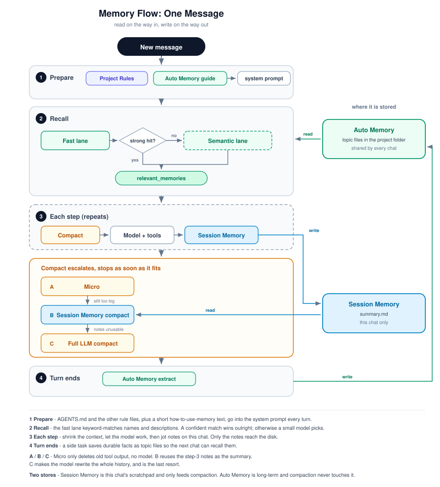
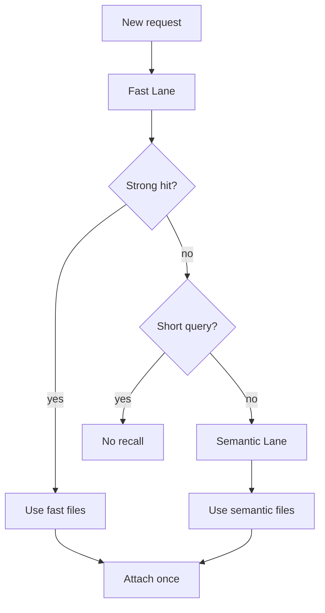
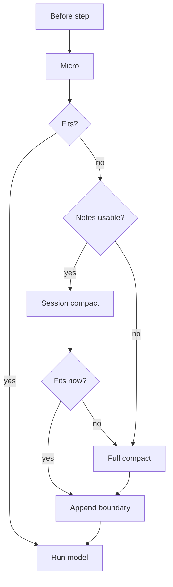

# Memory and Context

## Overview

The runtime has four related mechanisms, each with a different job. **Project Rules** are maintained instructions. **Auto Memory** recalls selected durable knowledge across sessions. **Session Memory** is a progress summary for one chat. **Compaction** reduces the active model context through Micro-compaction, Session Memory compact, or Full compact.

Auto Memory is not a compaction store. Compaction reads Session Memory when it can; it never uses Auto Memory as its summary.

For exact formats, thresholds, configuration, deployment boundaries, and tests, use the [canonical Agent Memory Guide](./memory-guide.md).

## At a glance

On the way into a turn, Project Rules shape behavior and Auto Memory may attach relevant topic files. During the chat, Session Memory records current progress. Before each model step, compaction may shrink the active view; on a successful turn end, Auto Memory extraction may save durable knowledge for future sessions.

The lifetimes stay separate:

- Project Rules: long-lived, manually maintained instructions.
- Auto Memory: project-wide topic files shared across sessions and Primary Agents.
- Session Memory: `summary.md` and state for this session only.
- Compaction: a context-management process, not another knowledge store.

## Key decision: Auto Memory recall

The Fast Lane always runs first and scores filename, `name`, and `description` metadata without a model call. An exact identity match, or a score of at least `0.82` with a lead of at least `0.12`, is strong: it selects up to three files and skips the Semantic Lane.

Without a strong hit, a small-model Semantic Lane may select up to five files. A no-whitespace query shorter than 10 characters skips that lane. Normal turns do not wait for semantic recall; explicit recall requests wait up to four seconds, then continue while a late result may still attach after a later step. The final result is **either Fast Lane files or Semantic Lane files, never a merge**. Files already surfaced or explicitly read in the session are filtered out.

## Responsibilities

- **Project Rules:** `loadAllAgentRules()` merges managed, user, and project/local rules. Static rules enter the system prompt; `paths:` rules attach only after a successful tool access matches a path.
- **Auto Memory:** prefetches relevant cross-session topics and can extract durable knowledge after a completed or `max_steps` turn. It should hold preferences and non-code facts, not facts readily available from source.
- **Session Memory:** incrementally maintains this chat's progress ledger outside the active transcript. Its main consumer is Session Memory compact.
- **Compaction:** rebuilds the active model projection and makes it fit while the complete append-only transcript remains available for UI history and replay.

## Compaction lifecycle

Micro-compaction clears older tool payloads only from the in-process model projection; it preserves call/result envelopes and writes no compact boundary. If the context is still too large, Session Memory compact reuses `summary.md` and preserves a recent, pairing-safe tail. Missing, stale, changing, or oversized notes cause Full compact to ask a model to summarize the active history.

Session Memory and Full compact append a `compact_boundary` plus a summary and regenerated attachments. Old transcript events are not deleted. `/compact <instructions>` chooses Full compact directly, and context-length recovery can run an aggressive Full compact with a preserved tail.

## Failure boundaries

- Semantic recall failure or timeout does not fail the main turn; recall can be empty or arrive later.
- Auto Memory extraction is a turn-end side path, so its failure does not change an already completed user turn.
- Session Memory extraction and compaction are race-checked. Unavailable or untrustworthy notes cause a Full compact fallback.
- If compaction cannot reduce the active view safely, the previous history remains intact; normal Full attempts stop after three consecutive failures.
- Remote SSH disables Project Rules and Auto Memory, while Session Memory and compaction continue in the control plane.

## Source map

- Turn orchestration: `src/utils/processUserInput/prepare_chat_turn.ts`, `src/turn/run-chat-turn.ts`, `src/turn/memory-lifecycle.ts`
- Project Rules: `src/utils/rules-loader.ts`, `src/utils/attachments.ts`
- Auto Memory: `src/services/auto-memory/`
- Session Memory: `src/services/session-memory/`
- Compaction and replay: `src/services/compact/`, `src/core/messages/compact-boundary.ts`, `src/session/compact-replay.ts`
- Canonical detail: `docs/architecture/memory-guide.md`

Last verified: 2026-09-13
