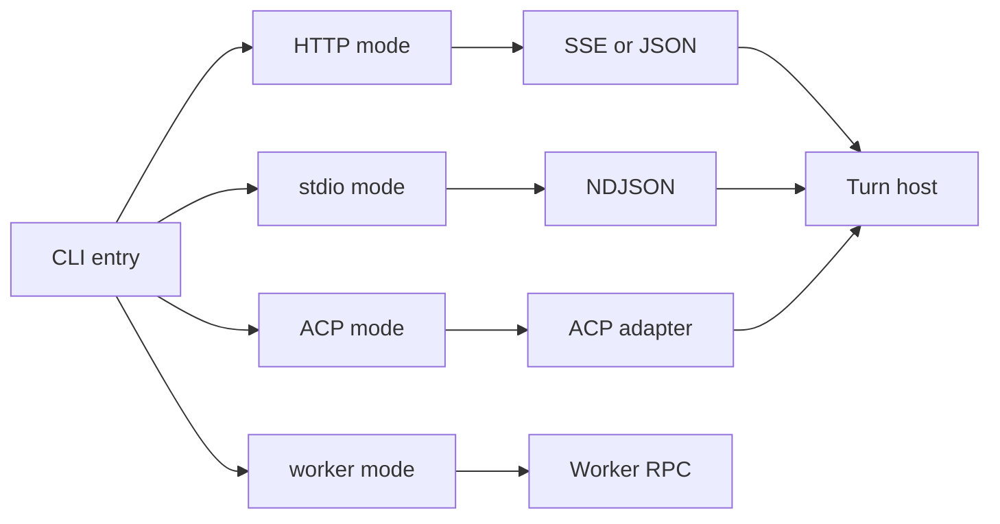
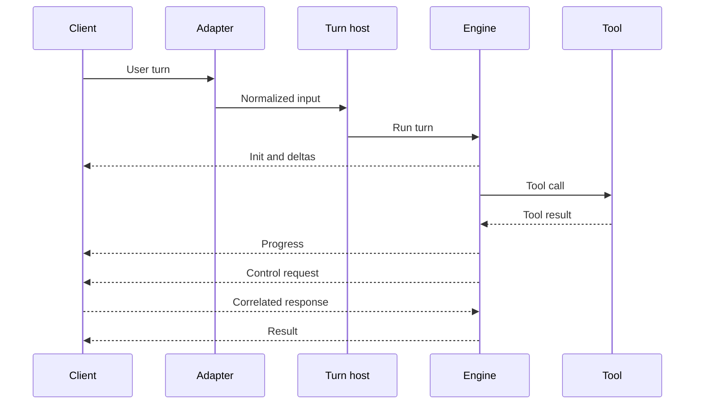
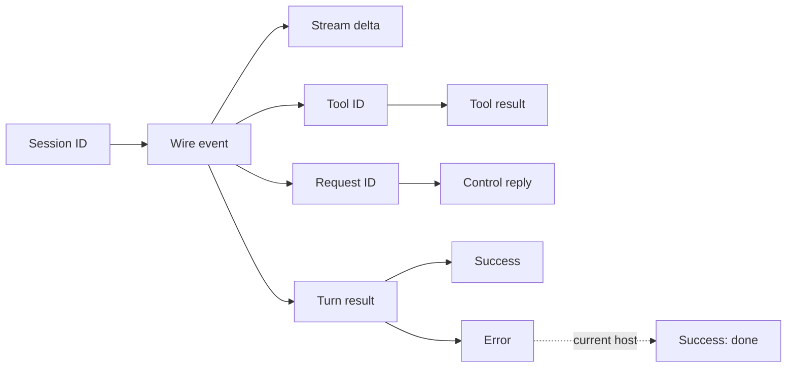

# Client Protocol

## Overview

The client protocol is the typed boundary between the agent engine and its clients. HTTP, stdio, and ACP use different wire formats, but ordinary turns converge on `runChatTurn()`. The worker stdio mode is a separate control-plane-to-worker protocol.

## At a glance

- The protocol package defines separate incoming and outgoing message unions.
- HTTP streaming names SSE events and serializes the same outgoing messages as JSON.
- Stdio writes one outgoing message per line and keeps stdout open between turns.
- ACP translates engine messages into ACP session updates; it is an adapter, not only a framing layer.
- `system/init` advertises a stable protocol version, permission mode, and working directory.

## End-to-end request and data flow

The turn host owns session setup, cancellation, persistence, and finalization. `WireEmitter` gives the engine one transport-neutral output API. SSE and NDJSON serialize its messages directly; the ACP sink maps text, reasoning, tools, plans, modes, and permission requests into ACP operations.

Interactive control is bidirectional. The engine can ask for permission, plan approval, or answers. A client can represent interrupts and mode changes in the shared input schema. Actual support still depends on the adapter: ACP handles cancellation through its own callback, while the current stdio reader dispatches successful control responses but ignores client control requests and cancel messages.

`session_id` associates events with a conversation. `tool_use_id` joins calls, progress, timing, and results, including concurrent tools. `request_id` joins a control request to its response or cancellation. `uuid` is optional, and `parent_tool_use_id` marks nested work.

A `result` reports turn completion. Clients should tolerate the current error path emitting `result/error` followed by `result/success` with reason `done`; it does not yet guarantee exactly one terminal result. Compaction has its own stronger pairing rule: every start is followed by done with `ok`, `noop`, or `error`.

## Responsibilities

- **Protocol package:** validates direction-specific message shapes and owns the protocol version.
- **Turn host:** creates the handshake, runs the engine, propagates aborts, persists messages, and closes the transport.
- **Wire emitter:** stamps correlation context and emits stream, tool, progress, control, and result events.
- **Transport adapters:** frame or translate messages without changing engine behavior.
- **Clients:** preserve correlation IDs, settle progress state, and answer supported control requests.

## Failure boundaries

- Invalid or incompatible messages must be rejected or ignored at the adapter boundary; breaking contract changes require a protocol-version bump.
- Any non-protocol output on stdout corrupts NDJSON and ACP JSON-RPC framing. Startup, worker, and diagnostic logs belong on stderr.
- HTTP disconnects and ACP cancellation can abort an active turn. Stdio intentionally keeps stdout open for later turns.
- A missing control response leaves the corresponding permission, plan, or question broker waiting until cancellation or another boundary ends it.
- Consumers must not join tool activity by tool name; concurrent calls require `tool_use_id`.
- `keep_alive` is a narrow compatibility escape hatch, not a container for arbitrary stable events.

## Source map

- `protocol/src/common.ts` — shared envelope and identifiers
- `protocol/src/wire.ts` — incoming and outgoing unions
- `protocol/src/server.ts` — engine-to-client messages
- `protocol/src/client.ts` — client-to-engine messages
- `protocol/src/control.ts` — bidirectional control messages
- `protocol/src/version.ts` — stable wire version
- `src/entrypoints/cli.ts` — mode selection
- `src/turn/run-chat-turn.ts` — shared turn lifecycle
- `src/core/wire-emitter.ts` — transport-neutral emission
- `src/server/sse-transport.ts` — SSE framing
- `src/server/stdio-transport.ts` — NDJSON output
- `src/server/stdio-input.ts` — NDJSON input handling
- `src/acp/turn-runner.ts` — ACP turn convergence
- `src/acp/translate-outbound.ts` — ACP translation
- `src/execution/runtime-protocol.ts` — separate worker RPC contract

Last verified: 2026-09-13
