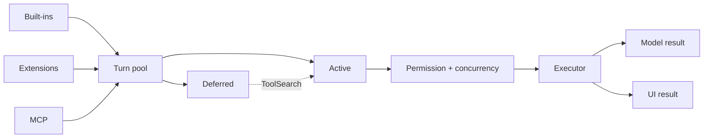
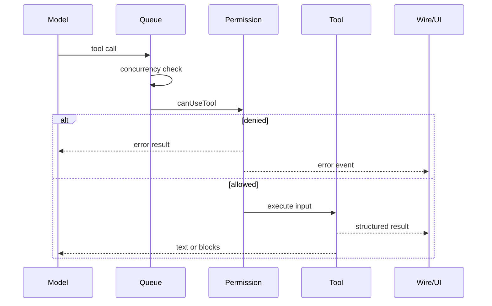
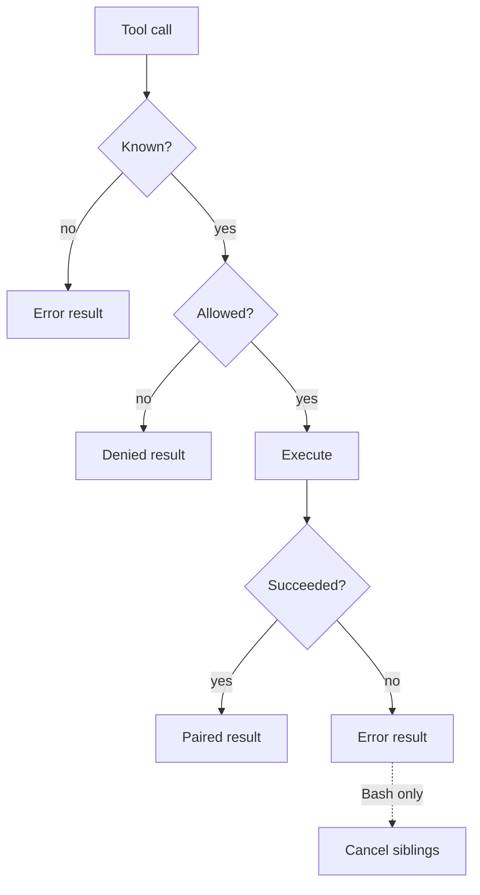

# Tools

## Overview

Tools are the agent's controlled way to act outside the model: read files, run commands, query language services, browse the web, ask the user, or delegate work. A `ToolDefinition` supplies the model-facing name and input schema; the runtime decides which tools are visible, whether a call is allowed, how it runs, and what each audience receives.

## At a glance

Built-ins are registered in `defaultRegistry`. Extensions add per-turn agent and skill tools, while code plugins can register definitions and MCP contributes externally supplied tools. `assembleToolPool()` splits this composition into active tools sent to the model and deferred tools withheld to save prompt space. Enablement, agent allow/deny globs, browser policy, and the current mode narrow the active set.

Deferred discovery is not execution: `ToolSearch` records a discovered tool so it can become active on a later model step. MCP tools are deferred by default; a definition marked `alwaysLoad` is not. Ask mode exposes known read-only tools and withholds `ToolSearch`, mutating tools, and deferred MCP tools.

## Key flow: one tool call

`StreamingToolExecutor` starts calls as their streamed `tool_use` blocks arrive. A call runs beside others only when its definition or the runtime policy says that specific input is concurrency-safe; unknown or unsafe calls default to serial behavior. Permission is checked immediately before execution and may allow, deny, or wait for the user's answer.

`executeOneTool()` normalizes the return into two coordinated projections. The model receives bounded text or content blocks such as images. The wire can additionally receive validated `tool_use_result` data for rich UI cards. Both projections keep the same tool-call ID so the transcript remains paired.

## Responsibilities

- **Definitions and registry:** declare schemas, factories, enablement, deferral, permission checks, concurrency safety, interrupt behavior, and optional result mapping.
- **Turn assembly:** combine built-ins, extensions, and MCP; then apply discovery state, settings, agent policy, browser policy, and mode restrictions.
- **Streaming executor:** queue calls, enforce serial/parallel ordering, obtain permission, propagate cancellation, and yield correlated results.
- **Execution layer:** invoke the implementation, map errors and dual-channel output, offload oversized text when needed, and build the model's tool message.

## Failure boundaries

Failures stay at the tool boundary: an unknown tool, denial, exception, timeout, or interruption becomes an error result associated with the original call. The implementation does not run after denial. A failed Bash prerequisite marks the parallel group as failed and cancels siblings; other tools retain their declared interrupt behavior. If deferred discovery and use are requested in the same parallel batch, the use fails because activation applies only to a later step.

## Source map

- Registration and composition: `src/tools.ts`, `src/core/tool-registry.ts`, `src/core/plugins/`, `src/skills/index.ts`, `src/tools/AgentTool/`
- Turn visibility: `src/tools/assembleToolPool.ts`, `src/core/tool-enablement.ts`, `src/core/mode-restrictions.ts`
- Runtime gates: `src/core/can-use-tool.ts`, `src/core/concurrency-policy.ts`
- Execution and results: `src/services/tools/StreamingToolExecutor.ts`, `src/services/tools/tool_execution.ts`
- Shared names and contracts: `src/constants/tool_names.ts`, `src/core/types.ts`

Last verified: 2026-09-13
