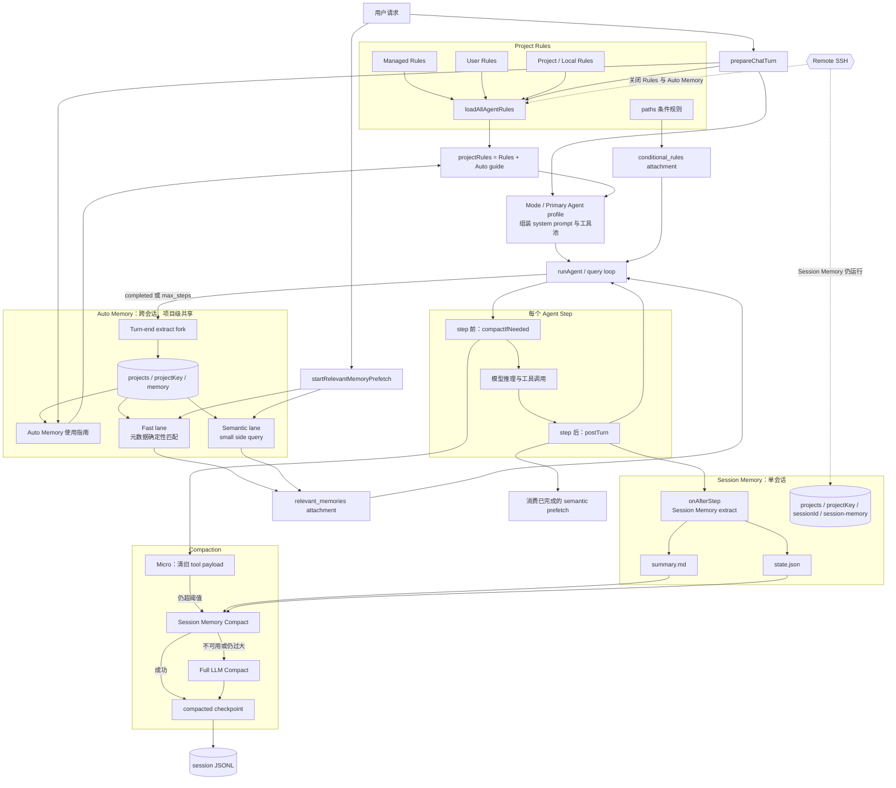

# Coding Agent 记忆系统开发指南

> 本文描述本仓库 `src/` 当前实际实现，最后核对日期为 2026-09-12。
> 这里的“记忆”包括 Project Rules、Auto Memory、Session Memory 与 Compaction。它们不是一套功能的四个名字，而是生命周期、存储位置和消费者都不同的四层机制。

## 1. 结论先行

当前运行时记忆架构只有四层：

1. **Project Rules**：人工维护的长期规则，每轮准备时重新加载。
2. **Auto Memory**：同一项目下由所有 Primary Agent 共享的跨会话主题记忆。
3. **Session Memory**：单个 session 的进度账本，主要供 compaction 使用。
4. **Compaction**：上下文接近上限时清理或总结历史消息。

当前没有一套按自定义 Agent 隔离的 Persistent Agent Memory：

- `AgentDefinition` 不再声明 `memory: user | project | local`。
- Agent markdown frontmatter 不解析 `memory:`。
- Browser Primary 与 General Primary 使用相同的项目 Auto Memory 目录。
- 子 Agent 不获得独立的持久化 memory 目录。
- 原有 `src/tools/AgentTool/agentMemory.ts` 与对应测试已经删除；Claude Code 参考文档中的同名模块只用于上游设计对照。

Auto Memory 的主题 frontmatter 当前只有 `name`、`description`、`type`。没有 `source: browser` 等来源字段，也没有按来源过滤的实现。

## 2. 整体架构图



图里的两条动态 attachment 通道不要和 system prompt 混淆：

- `relevant_memories` 来自 Auto Memory prefetch。
- `conditional_rules` 来自带 `paths:` frontmatter 的规则，在工具成功读写匹配文件后注入。

## 3. 一次完整 turn 的时序

### 3.1 Turn preparation

`src/utils/processUserInput/prepare_chat_turn.ts` 负责：

1. 解析 slash command。
2. 加载插件、skills、subagents 和 MCP。
3. 本地会话调用 `loadAllAgentRules(cwd)`。
4. 解析 Auto Memory 配置并调用 `buildAutoMemorySystemAppend()`。
5. 把规则与 Auto Memory 指南合成同一个 `projectRules` 字符串。
6. 解析 Primary Agent profile、组装工具池。
7. 把 Auto Memory 目录加入 `extraReadRoots` 和 `extraWriteRoots`。

随后 `resolveTurnSystemPrompt()` 选择默认 mode prompt 或 Primary Agent prompt。

### 3.2 主循环开始前

`src/turn/run-chat-turn.ts` 在用户消息已进入 session 后：

1. 创建 Session Memory 与 Auto Memory 生命周期 hooks。
2. 启动 Auto Memory fast / semantic prefetch。
3. 先消费 strong fast hit。
4. 如果用户明确表达“回忆之前内容”，最多等待 semantic lane 4 秒。
5. 把成功召回的内容作为 `relevant_memories` meta attachment 放入消息流。

### 3.3 每个 step

`src/core/query.ts` 的 step machine 按以下顺序运行：

1. `preTurn` 调用 `compactIfNeeded()`。
2. 模型推理并执行工具。
3. `postTurn` 消费已经完成但尚未注入的 semantic prefetch。
4. `onAfterStep` 异步触发 Session Memory 抽取。

### 3.4 整个 turn 结束

`emitTurnEnd()` 只在 `completed` 或 `max_steps` 时调用 `onTurnEnd`，异步触发 Auto Memory 抽取。

`aborted` 和 `error` 不触发本轮 Auto Memory 抽取；游标留在原处，让后续成功 turn 有机会覆盖完整范围。

## 4. Project Rules

Project Rules 是人工规定的行为，不是模型自动学习出的事实。

### 4.1 加载顺序

`src/utils/rules-loader.ts` 的 `loadAllAgentRules()` 按以下顺序合并：

1. Managed policy rules。
2. User rules。
3. Project 与 local rules。

项目规则从 `cwd` 向 git root 搜索。越靠近 `cwd` 的目录越晚出现，优先级更高。同一目录内顺序为：

1. 根目录 `AGENTS.md`。
2. `{appDir}/AGENTS.md`，默认是 `.ai-agent/AGENTS.md`。
3. `{appDir}/rules/**/*.md`。
4. `{appDir}/AGENTS.local.md`。
5. 根目录 `AGENTS.local.md`。

规则支持单独一行的 `@relative/path` 文本 include，最多递归 5 层。单文件与合并结果都有约 40 KiB 上限。

### 4.2 条件规则

`.ai-agent/rules/*.md` 如果带有 `paths:` frontmatter，不进入静态 system prompt。

当工具成功读写某个匹配文件后，`loadConditionalRulesForPaths()` 把它包装为 `conditional_rules` attachment。这样只有处理相关路径时才占用上下文。

Remote 会话或 Primary Agent 设置 `omitProjectRules: true` 时，条件规则也关闭。

### 4.3 适合保存的内容

- 构建、测试、格式化命令。
- 稳定代码规范和安全红线。
- 必须遵守的仓库工作流。
- 不应由模型自行猜测的长期项目约束。

临时进度放 Session Memory；跨会话偏好与非代码事实放 Auto Memory。

## 5. Auto Memory

Auto Memory 是项目级、跨会话、所有 Primary Agent 共用的主题文件集合。

### 5.1 默认存储路径

```text
{agentHome}/.ai-agent/projects/{projectKey}/memory/
├── MEMORY.md
├── <topic-a>.md
└── <topic-b>.md
```

本地 `projectKey` 来自 canonical git root；worktree 会归一到主仓。非 git 工作区使用规范化后的 cwd，再经 `sanitizePath()` 处理。

`autoMemory.directory` / `autoMemoryDirectory` 可以覆盖默认目录，但只信任 user 或 local settings。项目 settings 中的目录覆盖会被剥离，避免仓库把任意系统路径变成读写白名单。

在 SSO 模式中，覆盖路径还必须位于当前 tenant 的 `agentHome` 内。

### 5.2 主题文件格式与四种类型

```markdown
---
name: concise-memory-name
description: 用于未来相关性选择的一行具体描述
type: user
---

记忆正文
```

允许的 `type`：

- `user`：用户角色、知识背景、职责和稳定协作偏好。
- `feedback`：用户纠正或确认过的工作方式，重点记录“以后应该怎么做”。
- `project`：无法从当前代码或 git 历史推出的项目背景、动机、截止日期或组织事实。
- `reference`：外部系统中信息所在位置，例如 Linear 项目、Slack 频道或监控面板。

分类时优先保存最直接的语义。同一句“以后报告先列失败项”通常应是 `feedback`；只有它同时构成稳定的用户级沟通偏好时才考虑 `user`，不要机械地同时写两份。

不要保存：

- 能从当前代码、目录或配置直接读出的内容。
- git log / blame 已能回答的历史。
- 已写入 AGENTS.md 的规则。
- 当前任务的临时状态。
- credentials、cookies、tokens、个人表单数据。
- 临时 selector、tab ref、element ref 或一次性页面状态。

记忆会过期。使用文件路径、函数名、开关或当前项目状态前，必须以现有代码或外部权威来源复核。

### 5.3 System prompt 注入

`buildAutoMemorySystemAppend()` 默认只注入“如何使用 Auto Memory”的行为指南，不把整个记忆库或 `MEMORY.md` 正文塞进 system prompt。

默认 `prefetchEnabled: true` 时：

- 指南不要求维护 `MEMORY.md` 索引。
- 相关主题正文通过 prefetch attachment 进入上下文。

`prefetchEnabled: false` 是兼容模式：

- 不运行每轮相关性选择。
- system prompt 会附带截断后的 `MEMORY.md`。
- 写入或抽取后维护索引。
- 索引最多 200 行、25 KiB。

### 5.4 召回：Fast lane

`findFastRelevantMemories()` 只检查 filename、name 和 description 等元数据，不先读取所有正文。

以下情况视为 strong hit：

- 文件名、stem 或 name 与 query 有精确短语匹配。
- 第一名分数至少 `0.82`，并且领先第二名至少 `0.12`。

Strong fast hit 最多返回 3 篇，在 step 0 前立即注入。

### 5.5 召回：Semantic lane 与 4 秒显式等待

Semantic lane 使用 `prefetchModelTier: small` 的 side query，从候选 manifest 中最多选择 5 篇。

常规请求不等待 semantic lane；结果完成后由后续 `postTurn` 注入。用户明确询问“上次”“之前讨论过什么”“还记得吗”等历史内容时，`consumeMemoryPrefetchWithTimeout()` 在 step 0 前最多等待：

```ts
EXPLICIT_RECALL_TIMEOUT_MS = 4_000
```

4 秒内完成就立即注入；超时不取消任务，也不标记为已消费。结果稍后完成时仍可在某个 step 后 late attach。

无 strong fast hit 且 query 不含空格、长度小于 10 时，会跳过 semantic lane；短文件名和短 CJK query 仍先经过 fast lane。

每篇自动注入最多 200 行或 4096 bytes。同一 session 已 surface 的记忆正文累计达到 60 KiB 后，不再启动新的 prefetch。

### 5.6 两条写入路径

主 Agent 直接写：

- `prepareChatTurn` 把 memdir 加入额外读写根。
- Agent 可通过 Write / Edit 创建或更新主题文件。
- 默认 prefetch 模式只需写主题文件，不需要更新 `MEMORY.md`。
- 如果本轮已经成功直写 memdir，turn-end extract 会跳过，避免重复。

Turn-end side-query 抽取：

- 默认每个 eligible turn 都检查，`extractEveryNTurns` 当前硬编码为 1，尚未暴露为 settings。
- Extract fork 最多运行 5 steps。
- Read / Grep / Glob 可访问 workspace 与 memdir；Write / Edit 只能修改 memdir。
- `cacheSafe: true` 时复用主循环模型与 prompt cache 形状。
- `cacheSafe: false` 时使用单独的 `modelTier`，默认 medium。
- 同一 memdir 的任务串行；自动 pending 任务采用 latest-wins coalescing。

写入完成后只修复本次写过文件的 frontmatter。修复逻辑可以纠正缩进和需要 quote 的值，但不会猜测缺失的 `type`。

Auto Memory 抽取游标只保存在进程内，进程重启后会重置；它与 Session Memory 的持久化 `state.json` 不同。

## 6. Session Memory

Session Memory 是单 session 的工作进度账本，主要消费者是 Session Memory Compact。

### 6.1 存储路径

```text
{agentHome}/.ai-agent/projects/{projectKey}/{sessionId}/session-memory/
├── summary.md
└── state.json
```

这不是旧文档中的 `.sessions/{sessionId}/...`。

本地 session 与 Auto Memory 使用相同的项目桶规则。Remote SSH 使用 `sanitize(environmentId:cwd)` 作为 `projectKey`，避免不同远端环境混在一起。

### 6.2 summary.md

默认模板固定包含 10 个 section：

1. Session Title
2. Current State
3. Task specification
4. Files and Functions
5. Workflow
6. Errors & Corrections
7. Codebase and System Documentation
8. Learnings
9. Key results
10. Worklog

模板和抽取 prompt 可由工作区或 user app dir 下的 `.ai-agent/session-memory/template.md` 与 `prompt.md` 覆盖。

抽取后会校验固定 section 的完整性和顺序；格式损坏时尝试用旧内容补齐结构。

### 6.3 自动抽取条件

每个完成的 step 都会调用 `extractSessionMemoryInBackground()`，但只有达到阈值才实际 fork：

- 第一次总量达到 `minimumTokensToInit`，默认 10,000 tokens。
- 距上次成功抽取至少增长 `minimumTokensBetweenUpdate`，默认 5,000 tokens。
- 同时满足以下任意一个条件：
  - 自上次 trigger 至少有 `toolCallsBetweenUpdates`，默认 3 个工具调用。
  - 当前处于 natural break，即最后一条 assistant 消息没有 tool call。

`/summary` 使用 `force: true`，同步等待一次强制抽取。自动任务按 session 串行，并采用 latest-wins coalescing；强制任务保持 FIFO。

抽取 fork 最多 5 steps。默认 `cacheSafe: true`；非 cache-safe 模式使用 medium tier。受限模式基本只允许 Edit `summary.md`。

### 6.4 state.json

持久化字段：

- `initialized`：是否已越过首次初始化阈值。
- `tokensAtLastExtraction`：上次成功抽取时的 token 基线。
- `lastTriggerMessageId`：上次决定触发抽取时的末消息 UUID。
- `lastSummarizedMessageId`：natural break 抽取覆盖到的末消息 UUID，是 SM compact 的裁剪游标。
- `notesGeneration`：成功更新 notes 后递增，用于检测 compact 读文件期间的竞态。

只存在于进程内的字段：

- `inFlight`
- `extractionStartedAt`
- `extractionEpoch`

Compact 最多等待进行中的抽取 15 秒。超过 15 秒但未达到 stale 条件时跳过 SM compact，避免读取半写文件；超过 60 秒的抽取视为 stale，可放弃其所有权并继续。

## 7. Compaction

Compaction 在每个 agent step 前执行，顺序是：

1. Micro-compaction。
2. 如果仍超阈值，优先 Session Memory Compact。
3. Session Memory 不可用时回退 Full LLM Compact。

### 7.1 Token 阈值

默认 `contextWindow = 200,000`。未配置 `maxOutputTokens` 时预留 20,000：

```text
effectiveContextWindow = contextWindow - min(maxOutputTokens, 20,000)
autoCompactThreshold   = effectiveContextWindow - 13,000
microCompactThreshold  = autoCompactThreshold - 27,000
blockingLimit          = effectiveContextWindow - 3,000
```

默认结果：

- effective context window：180,000
- auto compact：167,000
- micro compact：140,000
- blocking limit：177,000

`tokenCountWithEstimation()` 混合使用真实 usage 与带 padding 的估算，避免只依赖字符数。

### 7.2 Micro-compaction

Micro 不调用模型：

- 对 read / shell / grep / web / browser 等工具清旧 output。
- 对 write / edit / apply_patch / NotebookEdit 等工具清旧 input。
- 任意 tool result 超过 2,000 chars 也可以被清理。
- 保留 tool-call 与 tool-result 外壳，避免破坏 API 配对。
- 默认保留最近 5 个可清理工具结果。
- aggressive 模式只保留最近 1 个。
- Read 结果被清后会失效对应 `readFileState`，必要时把大结果 offload 到 tool storage。

占位文案是：

```text
[Old tool result content cleared to save context]
```

Micro 只改变内存消息，不写 `compacted` checkpoint。

### 7.3 Session Memory Compact

SM compact 的前提是：

- `sessionMemory.enabled` 为 true。
- 没有带 steering instructions 的 `/compact`。
- 进行中的 extract 已安全结束，或已判定 stale。
- `summary.md` 存在、非空且不是空模板。
- 读取期间 `notesGeneration` 没有变化。
- `lastSummarizedMessageId` 如果存在，必须能在当前消息中找到。

裁剪算法从 `lastSummarizedMessageId` 之后开始保留，再向前扩展，满足：

- `compactMinTokens`，默认 10,000。
- `compactMaxTokens`，默认 40,000。
- `compactMinTextMessages`，默认 5。
- 不切断 tool-call / tool-result 配对。

最终消息形状是：

```text
[一条 role=user、isCompactSummary=true 的摘要消息]
[原样保留的最近消息]
[重新生成的 agent / skill attachments]
```

摘要正文还可带 Active Todo List、最近读文件内容；如果 Session Memory 被截断，会附上完整 `summary.md` 路径。

如果构建出的消息仍达到 auto compact 阈值，SM compact 放弃并回退 Full LLM Compact。

### 7.4 Full LLM Compact

Full compact 调用模型总结旧消息，并保留最近一段原始消息。以下情况会走 full：

- Session Memory 不可用或不可信。
- SM compact 后仍过大。
- `/compact <instructions>` 明确提供了总结 steering。
- 没有 sessionId 或 Session Memory 被关闭。

Full compact 会恢复有限数量的最近读文件、todos、agent / skill listing。aggressive reactive compact 会跳过文件恢复。

连续 3 次 full 失败会阻止后续普通 proactive compact；`force` 或 `aggressive` 仍可继续尝试。

### 7.5 持久化与恢复

只有 `session_memory` 和 `full` 两种总结型结果会调用 `appendCompaction()` 写 `type: compacted` 的 JSONL checkpoint。

恢复 session 时，遇到 `compacted` 行会用 checkpoint 整体替换此前消息，而不是继续追加。临时 attachment 在 checkpoint 前被过滤，恢复后按当前 agent / skill 状态重新生成。

Micro 没有 checkpoint，所以它的清理主要服务当前进程中的 API 上下文。

### 7.6 手动与 reactive 路径

- `/summary`：强制更新 Session Memory，不压缩消息。
- `/compact`：强制压缩；没有 instructions 时仍可优先 SM compact。
- `/compact <instructions>`：跳过 SM compact，使用 Full LLM Compact。
- 模型返回 context-length error：`run-step.ts` 触发 force + aggressive compact 后重试。

## 8. Primary Agent、Browser 与子 Agent

Primary Agent profile 在 agent mode 下替换默认 system prompt，并通过工具 allow-list / deny globs 决定主线程工具池。

记忆功能与 profile 不是完全绑在一起：

- Auto Memory prefetch、turn-end extract、Session Memory extract 和 compaction 在主线程 turn lifecycle 中运行。
- Project Rules 与 Auto Memory 使用指南先被合并成同一个 `projectRules` 字符串。
- `omitProjectRules: true` 会把这个完整字符串从 Primary Agent system prompt 中移除，因此既移除 Project Rules，也移除 Auto Memory 使用指南。
- 这个开关不会自动关闭独立启动的 Auto Memory prefetch 和 turn-end extract。

当前 `.ai-agent/agents/browser.md` 设置了 `omitProjectRules: true`。因此 Browser Primary：

- 与 General Primary 共用 Auto Memory 存储和召回。
- 仍可获得 `relevant_memories` attachment。
- 仍会运行 turn-end Auto Memory 抽取。
- 但不会在自身 system prompt 中看到统一 Auto Memory 写入指南，也不会看到 Project Rules / conditional rules。

子 Agent 走 `AgentTool` fork 路径，不拥有独立 Auto Memory 生命周期。它可以获得项目规则，但不会独立启动主线程的 prefetch / extract，也没有 per-agent memdir。

## 9. 配置默认值

### 9.1 Auto Memory

- `enabled: true`
- `extractEveryNTurns: 1`，当前硬编码，settings 不可配
- `cacheSafe: true`
- `modelTier: medium`，仅 non-cache-safe extract 使用
- `prefetchEnabled: true`
- `prefetchModelTier: small`

Settings 同时兼容 flat keys 与 nested `autoMemory`。目录覆盖只能来自受信 user / local scope。

### 9.2 Session Memory

- `enabled: true`
- `minimumTokensToInit: 10,000`
- `minimumTokensBetweenUpdate: 5,000`
- `toolCallsBetweenUpdates: 3`
- `cacheSafe: true`
- `modelTier: medium`
- `compactMinTokens: 10,000`
- `compactMaxTokens: 40,000`
- `compactMinTextMessages: 5`

Session Memory 抽取本身不依赖 `compaction.enabled`；该开关控制的是普通 proactive compaction。

### 9.3 Compaction

- `enabled: true`
- `contextWindow: 200,000`
- `microCompactKeepRecent: 5`
- `maxFilesToRestore: 5`
- `maxTokensPerFile: 5,000`
- `fileBudget: 50,000`
- `timeBasedMicroEnabled: false`
- `timeBasedMicroGapMinutes: 5`

相关环境变量：

- `DISABLE_AUTO_COMPACT=1`
- `DISABLE_COMPACT=1`
- `COMPACT_CONTEXT_WINDOW`
- `COMPACT_MICRO_KEEP`
- `COMPACT_THRESHOLD_OVERRIDE`
- `DISABLE_TIME_BASED_MICRO=1`
- `COMPACT_TIME_GAP_MIN`

## 10. 部署与安全边界

### 10.1 Local Web / Electron

- Project Rules、Auto Memory、Session Memory 与 Compaction 全部启用。
- `agentHome` 通常是本机用户 home。

### 10.2 Admin Cloud

- 记忆位于服务端持久卷。
- Session Memory 的 `state.json` 可在进程重启后恢复游标。

### 10.3 SSO Cloud

- RequestScope 通过 `AsyncLocalStorage` 绑定 `{ agentHome, cwd }`。
- Rules、Auto Memory、Session Memory 与 session JSONL 都按 tenant `agentHome` 隔离。
- Auto Memory 自定义目录必须位于当前 tenant home 内。
- 后台 extract 会捕获并重新进入原 request scope。

### 10.4 Remote SSH

- 本地 Project Rules 与 Auto Memory 整族关闭：不注入指南、不 prefetch、不 extract。
- Session Memory 与 Compaction 仍在控制面运行。
- Session project key 包含 remote `environmentId` 与 remote cwd。
- 代码工具通过远端 Worker 执行，不能静默回退到本地文件系统。

### 10.5 文件系统边界

- Auto Memory 通过额外读写根显式授权。
- Extract fork 的 Write / Edit 被限制在 memdir。
- 路径检查同时做 lexical containment 与 existing-ancestor realpath 校验，阻止 symlink 逃逸。
- 项目 settings 不能把任意目录升级为 Auto Memory 写根。

## 11. 故障降级与已知限制

- Semantic prefetch 失败时返回空结果，不应阻断主 turn。
- 显式 recall 4 秒超时后继续主流程，结果仍可 late attach。
- Session Memory extract 超过 15 秒时，当前 compact 跳过 SM，转用 full。
- Auto Memory turn-end 状态仅在进程内；重启会重置 cursor 和 throttle。
- Auto Memory 扫描最多处理 200 个主题文件。
- 默认 prefetch 模式下 `MEMORY.md` 通常是空兼容入口，不是主召回索引。
- 当前 memory schema 没有 `source` 字段，不能按 Browser / General 来源过滤。
- `omitProjectRules` 同时控制 Rules 和 Auto Memory 指南，粒度较粗。
- 真实 LLM 端到端质量仍受 selector / extractor 模型和提示词影响；多数单测使用 stub 或 mock。

调试时可重点查看：

- `[auto-memory]`：目录、prefetch、extract、frontmatter repair。
- `[session-memory]`：阈值、队列、state、等待与 stale extract。
- `[compact]`：token、micro、SM fallback、full 结果和 circuit breaker。
- `[agent:main] memory recall decision=...`：step 0 召回时序。

## 12. 测试入口

完整记忆测试：

```powershell
npm run test:memory
```

它当前串联：

- `src/scripts/test-auto-memory.ts`
- `src/scripts/test-memory-prefetch.ts`
- `src/scripts/test-session-memory.ts`
- `src/scripts/test-memory-lifecycle.ts`
- `src/scripts/test-request-scope.ts`
- `src/scripts/test-memory-deployment.mjs`
- `src/scripts/test-rules-loader.ts`
- `src/scripts/test-managed-extensions.ts`

## 13. 代码地图

Turn 编排：

- `src/utils/processUserInput/prepare_chat_turn.ts`
- `src/turn/run-chat-turn.ts`
- `src/turn/memory-lifecycle.ts`
- `src/core/query.ts`
- `src/core/query/pre-turn.ts`
- `src/core/query/post-turn.ts`

Project Rules：

- `src/utils/rules-loader.ts`
- `src/utils/attachments.ts`

Auto Memory：

- `src/services/auto-memory/paths.ts`
- `src/services/auto-memory/inject.ts`
- `src/services/auto-memory/prefetch.ts`
- `src/services/auto-memory/findRelevant.ts`
- `src/services/auto-memory/extract.ts`
- `src/services/auto-memory/scan.ts`
- `src/services/auto-memory/state.ts`

Session Memory：

- `src/services/session-memory/extract.ts`
- `src/services/session-memory/compact.ts`
- `src/services/session-memory/state.ts`
- `src/services/session-memory/keepIndex.ts`
- `src/services/session-memory/template.ts`
- `src/services/session-memory/paths.ts`

Compaction：

- `src/services/compact/autoCompact.ts`
- `src/services/compact/microCompact.ts`
- `src/services/compact/compact.ts`
- `src/services/compact/tokens.ts`
- `src/services/compact/fileRestore.ts`
- `src/services/compact/post-compact-attachments.ts`

配置与持久化：

- `src/core/settings-manager.ts`
- `src/core/settings-schema.ts`
- `src/core/types.ts`
- `src/core/session-paths.ts`
- `src/session/store.ts`

## 14. 设计原则

判断一条信息应该去哪一层：

1. 是必须长期遵守的人工作业规范吗？放 Project Rules。
2. 是跨会话仍有价值、且不能从代码直接读出的偏好或事实吗？放 Auto Memory。
3. 是当前 session 的进度、错误现场或下一步吗？放 Session Memory。
4. 是为了降低当前上下文 token 吗？交给 Compaction。

不要创建额外的 `MEMORY.md` 体系，也不要按 Primary Agent 再复制一套记忆。跨会话共享由统一 Auto Memory 负责；单会话连续性由 Session Memory 与 compaction checkpoint 负责。
