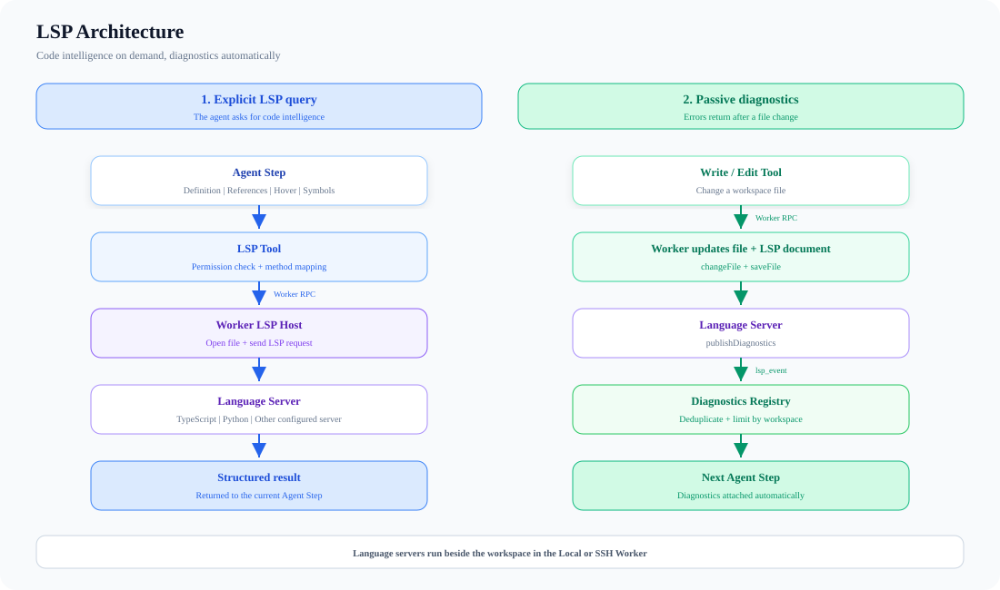

# Language Server Protocol

The LSP subsystem gives the agent structured code intelligence—definitions,
references, symbols, hover information, and diagnostics—without asking the
model to infer everything from text search.

## How it works

Language servers run beside the workspace in the worker execution plane. This
keeps local and SSH behavior consistent and lets status flow back through the
same runtime protocol as file and shell operations.

There are two paths:

- **Explicit query:** the Agent calls the LSP tool for definitions, references,
  hover information, implementations, or symbols.
- **Passive diagnostics:** after Write or Edit, the Worker updates the open LSP
  document. Published diagnostics are deduplicated and attached automatically
  to the next Agent step.

## Configuration

`lspServers` maps server definitions to commands and file patterns. The exact
schema is defined by `src/core/settings-schema.ts`; use project settings for
workspace-specific servers and user settings for personal defaults.

## Failure modes

- The configured server executable must exist in the selected execution
  environment, not only on the control-plane host.
- Initialization can be slow; the manager owns startup and lifecycle state.
- Text search remains the fallback when no language server is configured or a
  server does not support the requested method.

## Source map

- `src/tools/LSPTool/LSPTool.ts`
- `src/services/lsp/LSPDiagnosticRegistry.ts`
- `src/services/lsp/passiveFeedback.ts`
- `src/services/lsp/server-instance.ts`
- `src/worker/lsp-host.ts`
- `src/execution/worker-execution-backend.ts`

**Last verified:** 2026-09-13
