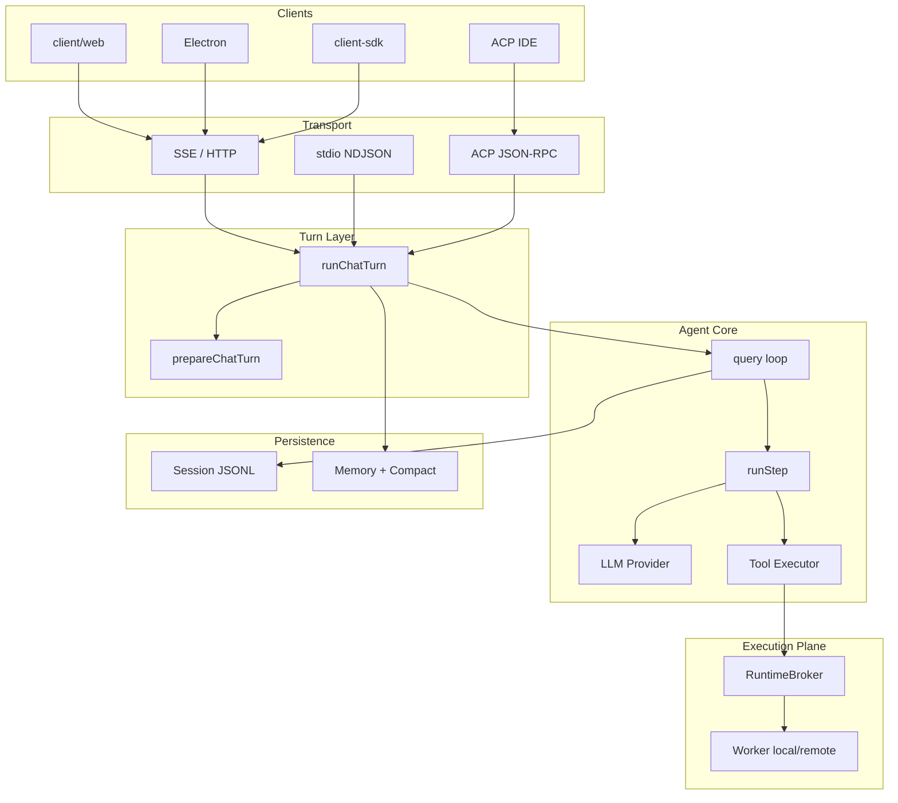

# Coding Agent 系统架构总览

> 基于仓库源码整理，面向其它工程团队的技术介绍。  
> 最后对照代码路径：`start.js`、`src/turn/run-chat-turn.ts`、`src/core/query.ts`、`src/server/router.ts`、`protocol/`。

---

## 1. 产品定位

**Coding Agent**（仓库内亦称 Baize）是一个可本地运行、可自托管的 AI 编程助手。核心能力包括：

- 多轮对话 + 工具调用（读改文件、执行 Shell、搜索、LSP、浏览器自动化等）
- 子 Agent 任务分解（Explore / Plan / general-purpose 及自定义 Agent）
- Skills、MCP、Plugins 扩展
- 长会话上下文管理（Compaction、Session Memory、Auto Memory）
- 本地与远程（SSH）工作区执行
- 多入口：Web UI、Electron 桌面、stdio CLI、ACP（VS Code / Cursor / IntelliJ）

**设计原则（从代码结构可见）：**

1. **Protocol 先行** — 引擎与 UI/Transport 解耦，`protocol/` 定义 wire 消息，`WireEmitter` 负责发出，各 Transport 只序列化。
2. **Turn 宿主统一** — HTTP `/chat`、stdio CLI、ACP 均调用 `runChatTurn()`，避免三套业务逻辑。
3. **执行面与控制面分离** — HTTP Server 是控制面；文件/Shell/LSP 经 Worker Runtime RPC 执行（本地或 SSH 远程同构）。
4. **配置分层** — user / project / local / managed 多级 settings，支持平台统一下发策略。

---

## 2. 仓库结构

```text
ai_coding_agent_intro/
├── start.js                 # 统一入口：--acp | --stdio | 默认 HTTP
├── src/                     # Agent 引擎（核心）
│   ├── entrypoints/cli.ts   # 模式分发
│   ├── server/              # HTTP Server、路由、Session、Workspace API
│   ├── turn/                # runChatTurn — Transport 无关的 Turn 宿主
│   ├── core/                # Agent 循环、LLM、Settings、权限、沙箱
│   ├── tools/               # 各 Tool 实现（*Tool/ 目录）
│   ├── services/            # compact、session-memory、auto-memory、lsp、tools 执行
│   ├── execution/           # 执行控制面：local / SSH Provider、RuntimeBroker
│   ├── worker/              # Worker 进程：FS / Shell / LSP / rg
│   ├── acp/                 # Agent Client Protocol 适配
│   ├── cli/                 # stdio NDJSON CLI
│   ├── browser/             # 浏览器自动化（Playwright + Chrome 扩展中继）
│   ├── skills/              # Skill 加载与 fork
│   ├── commands/            # Slash commands
│   ├── prompts/             # 各 mode / agent profile 的 system prompt
│   └── session/             # Session 持久化（JSONL）
├── protocol/                # @ai-agent/protocol — wire 协议（Zod schema）
├── client/web/              # React + Vite 前端
├── client-sdk/              # TypeScript HTTP 客户端 SDK
├── client-sdk-py/           # Python 客户端 SDK
├── electron/                # 桌面壳（内嵌 agent 子进程）
├── deploy/                  # Docker 部署（admin / SSO）
├── analytics/               # 用量与成本分析（可选部署）
└── .ai-agent/               # 项目级 skills / agents / commands / settings
```

---

## 3. 运行模式

`start.js` → `src/entrypoints/cli.ts` 按 argv 选择模式：

| 模式 | 启动方式 | 通信 | 用途 |
|------|----------|------|------|
| **HTTP**（默认） | `npm start` | HTTP + SSE，`PORT` 默认 4567 | Web UI、SDK、生产部署 |
| **stdio** | `npm run cli` | stdin/stdout NDJSON | 脚本集成、headless |
| **ACP** | `npm run acp` | stdout JSON-RPC 2.0 | VS Code / Cursor / IntelliJ |

ACP 模式下 `console.log` 等重定向到 stderr，保证 stdout 纯净协议。

HTTP Server 启动时（`src/server/index.ts`）还会：

- 可选托管 `client/web/dist` 静态资源（`SERVE_STATIC=0` 时为纯 headless API）
- `bootstrapExecutionPlane()` — 注册 local / SSH Provider
- `initBrowserLifecycle()` — 浏览器生命周期
- 优雅关闭时清理 Execution Plane 与 LSP

---

## 4. 端到端架构

```text
┌─────────────────────────────────────────────────────────────────────────┐
│  CLIENTS                                                                 │
│  ┌──────────────┐  ┌──────────────┐  ┌──────────────┐  ┌────────────┐ │
│  │ client/web   │  │ Electron     │  │ ACP Client   │  │ client-sdk │ │
│  │ React + SSE  │  │ 内嵌 :4567   │  │ IDE 插件     │  │ HTTP API   │ │
│  └──────┬───────┘  └──────┬───────┘  └──────┬───────┘  └─────┬──────┘ │
└─────────┼─────────────────┼─────────────────┼────────────────┼────────┘
          │                 │                 │                │
          ▼                 ▼                 ▼                ▼
┌─────────────────────────────────────────────────────────────────────────┐
│  TRANSPORT LAYER                                                         │
│  HTTP/SSE (sse-transport)  │  stdio NDJSON  │  ACP JSON-RPC (acp/)      │
└─────────────────────────────────┬───────────────────────────────────────┘
                                  │ 均调用 runChatTurn()
                                  ▼
┌─────────────────────────────────────────────────────────────────────────┐
│  TURN HOST — src/turn/run-chat-turn.ts                                   │
│  prepareChatTurn → runAgent(query) → 持久化 / wire 事件                  │
└─────────────────────────────────┬───────────────────────────────────────┘
                                  ▼
┌─────────────────────────────────────────────────────────────────────────┐
│  AGENT LOOP — src/core/query.ts                                          │
│  for step: preTurn(compact) → runStep(LLM stream + tool execute) → …     │
└───────────────┬─────────────────────────────┬───────────────────────────┘
                │                             │
                ▼                             ▼
┌───────────────────────────┐   ┌───────────────────────────────────────────┐
│  LLM Provider            │   │  TOOLS + EXECUTION                         │
│  model-registry          │   │  ToolRegistry / assembleToolPool           │
│  large/medium/small      │   │  StreamingToolExecutor                     │
│  openai / anthropic /    │   │  → ExecutionBackend (Worker RPC)           │
│  openai-compatible       │   │     local Worker │ SSH remote Worker      │
└───────────────────────────┘   └───────────────────────────────────────────┘
                │
                ▼
┌─────────────────────────────────────────────────────────────────────────┐
│  PERSISTENCE & SIDE SERVICES                                             │
│  Session JSONL │ Compaction │ Session Memory │ Auto Memory │ Telemetry  │
└─────────────────────────────────────────────────────────────────────────┘
```

---

## 5. Wire 协议（`protocol/`）

`@ai-agent/protocol` 是引擎与所有 GUI/客户端之间的**单一真相源**。

- **OutgoingMessage**（引擎 → 客户端）：`system/init`、`stream_event`（text/reasoning delta）、`assistant`、`tool_call`、`tool_result`、`result`、`control_request` 等
- **IncomingMessage**（客户端 → 引擎）：`user`、`control_response` 等
- 每条消息带 `session_id`、`uuid` 等 envelope 字段
- `PROTOCOL_VERSION` 在 `system/init` 握手中声明

Transport 适配器职责：

| 组件 | 文件 | 职责 |
|------|------|------|
| WireEmitter | `src/core/wire-emitter.ts` | 引擎侧发出 typed 消息 |
| SSE Transport | `src/server/sse-transport.ts` | HTTP 流式 |
| stdio Transport | `src/server/stdio-transport.ts` | NDJSON 行协议 |
| ACP | `src/acp/` | JSON-RPC ↔ wire 翻译 |

---

## 6. 一次对话的完整流程

### 6.1 HTTP `/chat` 入口

`src/server/routes/chat.ts`：

1. 解析 `message`、`session_id`、`workspace`、`mode`、`agentType`、`environmentId`
2. 解析/创建 Session，绑定 `WorkspaceHandle`（`environmentId` + `cwd`）
3. `tryBeginTurn()` — 同 Session 禁止并发 Turn
4. 创建 SSE Transport 或缓冲 JSON
5. 调用 `runChatTurn({ ... runAgent })`

### 6.2 Turn 准备 — `prepareChatTurn`

`src/utils/processUserInput/prepare_chat_turn.ts`：

| 步骤 | 说明 |
|------|------|
| Slash 解析 | `/help`、`/compact`、`/summary`、skill fork 等 |
| 加载 Plugins | `loadPlugins(cwd)` — agents、skills、MCP servers |
| 注册 Subagents | `registerSubagents()` — 内置 + 磁盘 `.ai-agent/agents/` |
| 注册 Skills | `registerSkills()` — 条件激活 |
| 加载 Project Rules | `loadAllAgentRules(cwd)` + Auto Memory append |
| 解析 ExecutionBackend | `resolveExecutionBackend(session)` — Worker RPC |
| 组装 Tool Pool | `assembleToolPool()` — active / deferred / mode tools |
| 构建 ToolUseContext | sandbox、readFileState、middleware 等 |

远程 Session（`ssh:*`）时：plugins/skills/MCP 从控制机 default workspace 加载，但 Shell/文件工具在远程 Worker 上执行。

### 6.3 Turn 执行 — `runChatTurn`

`src/turn/run-chat-turn.ts`：

1. `resolveSettings()` + `createModelRegistry()` — 三档模型
2. 处理 mode 切换、skill fork、manual compact、`/summary`
3. 发出 `system/init`、`mode_changed`（握手）
4. 注册 middleware（timing、plan-mode-guard、plugin hooks）
5. 启动 memory prefetch（Auto Memory 相关检索）
6. 调用 `runAgent()` → 内部 `query()`
7. Turn 结束后 `appendMessage()` 持久化新增消息

### 6.4 Agent 主循环 — `query`

`src/core/query.ts`（对齐 Claude Code `query()`）：

```text
for step in 0..maxSteps:
  preTurn()          # 每步前 compactIfNeeded（含 micro/full compact）
  runStep()          # 一次 LLM 往返 + 工具执行
  处理 mode_changed / plan_ready 等事件
  若达 step 上限 → forceFinalAnswerOnMaxSteps
```

### 6.5 单步执行 — `runStep`

`src/core/query/run-step.ts`：

1. 消息 sanitize / projectMessagesForApi / cache control
2. `streamText()` 调用 LLM（via `ai` SDK + Provider strategy）
3. `StreamingToolExecutor` 并发执行 tool calls
4. `buildToolMessage()` — **双路结果**：LLM 看精简文本投影，UI/wire 可走完整 blocks
5. 上下文超长时 reactive compact / transient retry

---

## 7. 工具体系

### 7.1 注册与目录约定

- 全局注册表：`src/tools.ts` → `defaultRegistry`
- 每个工具：`src/tools/FooTool/FooTool.ts`（`ToolDefinition`）+ `prompt.ts`
- 运行时按名引用：`src/constants/tool_names.ts`

### 7.2 内置工具（`src/tools.ts` 直接注册）

| 类别 | 工具名 |
|------|--------|
| Shell | `Bash`（Windows 额外 `PowerShell`） |
| 文件 | `Read`、`Write`、`Edit`、`Glob`、`Grep` |
| 任务 | `TaskOutput`、`TaskStop`（后台 Bash Task） |
| 代码智能 | `LSP` |
| 网络 | `WebSearch`、`WebFetch` |
| 交互 | `AskUserQuestion`、`TodoWrite` |
| 浏览器 | `browser_*` 系列（约 20 个） |
| 模式 | `EnterPlanMode`、`ExitPlanMode`（经 assembleToolPool 注入） |

### 7.3 动态注册（每 Turn 在 prepareChatTurn 中）

| 来源 | 机制 |
|------|------|
| **Agent** | `AgentTool` — 单一 `Agent` 工具，`subagent_type` 分发 |
| **Skill** | `Skill` 工具 — 按需加载 SKILL.md 内容 |
| **MCP** | `mcp-lifecycle` — stdio/SSE MCP server 工具并入 registry |
| **Deferred** | 非 active 工具进 deferred pool，通过 `ToolSearch` 按需激活 |

`assembleToolPool()`（`src/tools/assembleToolPool.ts`）还处理：

- Permission mode 过滤（ask 模式提升只读 deferred 工具）
- 主线程 Agent profile 的 `tools` allowList / `disallowedTools` glob
- Browser specialist 提升 `browser_*` 为 active（避免 ToolSearch 竞态）

### 7.4 工具执行

`src/services/tools/StreamingToolExecutor.ts` + `tool_execution.ts`：

- 并发策略：`buildConcurrencyPolicy()`
- 中断：`tool-abort-registry`（`POST /tool/abort`）
- 大结果持久化：`services/tool-storage/`
- Middleware 钩子：`beforeTool` / `afterTool`（plan guard、timing、plugins）

---

## 8. 子 Agent（Agent Tool）

内置三种（`src/tools/AgentTool/built-in/`）：

| agentType | 模式 | modelTier | 典型工具 |
|-----------|------|-----------|----------|
| `Explore` | 只读 | small | Read, Grep, Glob, Bash(只读) |
| `Plan` | 只读 | large | 同上 + 规划向 prompt |
| `general-purpose` | 读写 | large | 完整工具集 |

扩展：

- 磁盘：`<workspace>/.ai-agent/agents/*.md`（frontmatter 定义 `tools`、`modelTier`、`mode`）
- Plugins：打包的 agent markdown
- 主线程 specialist：`session.agentType` + `POST /session/agent` 切换，替换 system prompt

`Agent` 工具实现：`src/tools/AgentTool/AgentTool.ts`，子 agent 通过 `forked-agent` + 独立 `query()` 运行，事件经 `subagent-bus` / `subagent-wire` 投影到主线程 UI。

---

## 9. Skills、Commands、Rules

| 机制 | 路径 | 加载时机 |
|------|------|----------|
| **Skills** | `.ai-agent/skills/*/SKILL.md` | `registerSkills()`，条件匹配 candidate files |
| **Slash Commands** | `.ai-agent/commands/` | `dispatchSlashCommand()` |
| **Project Rules** | `AGENTS.md` / `CLAUDE.md`（git root → cwd 向上合并） | `loadAllAgentRules()` |
| **User Rules** | `~/.ai-agent/AGENTS.md` | 同上 |
| **Plugins** | `.ai-agent/plugins/` | `loadPlugins()` — 可携带 agents/skills/MCP |

Skill 调用方式：

- Inline slash：展开为 prompt
- Fork slash：独立 skill 会话（`respondSkillFork`）

---

## 10. 记忆与上下文管理

### 10.1 四层记忆（职责划分）

| 层 | 实现 | 作用 |
|----|------|------|
| **Project Rules** | `rules-loader` | 每次 turn 注入 system prompt |
| **Auto Memory** | `services/auto-memory/` | 跨会话 `.ai-agent/auto-memory/` 持久化偏好 |
| **Session Memory** | `services/session-memory/` | 单会话笔记，compact 时消费 |
| **Compaction** | `services/compact/` | 上下文压缩（full / micro / reactive 等） |

### 10.2 Compaction 触发点

- **每 step 前**：`preTurn()` → `compactIfNeeded()`
- **手动**：`/compact [instructions]`
- **Turn 结束**：memory lifecycle hooks（`turn/memory-lifecycle.ts`）

### 10.3 Auto Memory Prefetch

`runChatTurn` 中若启用，会在主循环前启动 `startRelevantMemoryPrefetch()`，用 small 模型检索相关记忆片段注入上下文。

---

## 11. LLM 与三档模型

`src/core/llm/model-registry.ts`：

| 档位 | 典型用途 |
|------|----------|
| **large** | 主 Agent 循环、Plan、Compaction |
| **medium** | Auto Memory 抽取（默认） |
| **small** | Explore 子 agent、Session 标题、Memory prefetch |

Provider 策略（`src/core/llm/strategies/`）：

- `openai`
- `anthropic`
- `openai-compatible`（通用兼容端点）

配置：`settings.json` 的 `models.large|medium|small`，回退链 `small → medium → large`。

**无智能路由** — 按调用点静态绑定 `modelTier`，便于成本预测与调试。

---

## 12. Permission Mode（会话权限模式）

`src/core/permission-mode.ts` 定义三种外部模式：

| 模式 | UX | 工具限制 |
|------|-----|----------|
| `agent` | 完整 Agent | 默认工具集 |
| `ask` | 只读问答 | 提升只读 deferred；禁止 mutating |
| `plan` | 规划 | 禁止写文件/执行 mutating；`EnterPlanMode` / `ExitPlanMode` |

切换入口：

- 请求体 `mode` 字段
- `POST /session/mode`
- Plan 审批：`POST /plan/approve`（`plan-approval-broker`）

---

## 13. 执行平面（Execution Plane）

### 13.1 控制面组件

`src/execution/bootstrap.ts` 单例：

| 组件 | 职责 |
|------|------|
| `EnvironmentRegistry` | 注册 local / SSH Provider |
| `CredentialBroker` | 运行时认证、AuthProxy |
| `RuntimeBroker` | 按 `WorkspaceHandle` 管理 Worker 连接 |
| `WorkspaceService` | 工作区绑定语义 |
| `PermissionGateway` | 远程执行权限 |

### 13.2 Worker Runtime

`src/worker/main.ts` — 独立进程，stdio NDJSON RPC：

- **FS**：readText、writeText、listDir、stat…
- **Shell**：前台/后台命令（`runShellCommand`）
- **LSP**：`lsp-host.ts` — 语言服务在 Worker 内运行
- **rg**：`run-rg.ts` — Grep 加速

控制面通过 `WorkerExecutionBackend`（`worker-execution-backend.ts`）发 `fs_op` / `lsp_op` RPC。

### 13.3 本地 vs 远程

| environmentId | 说明 |
|-----------------|------|
| `local` | 本机 Worker |
| `ssh:<host>` | SSH Provider 在远程拉起同构 Worker |

Session 绑定：`session.workspace = { environmentId, cwd }`  
远程判定：`isRemoteWorkspace()` — `environmentId.startsWith('ssh:')`

---

## 14. HTTP Server API 概览

`src/server/router.ts` 主要路由：

| 方法 | 路径 | 说明 |
|------|------|------|
| GET | `/health` | 健康检查 |
| POST | `/chat` | 主聊天（SSE 或 JSON） |
| POST | `/chat/cancel` | 中止当前 Turn |
| POST | `/tool/abort` | 中止单个工具/子 agent |
| POST/GET/DELETE | `/sessions` | Session CRUD |
| GET | `/sessions/:id/messages` | 历史消息 |
| GET/PATCH | `/settings` | 配置读写 |
| GET | `/mcp`、`/lsp` | MCP/LSP 状态 |
| POST | `/session/mode`、`/session/agent` | 模式与 specialist 切换 |
| POST | `/ask_user_question/answer` | HITL 问答 |
| POST | `/plan/approve` | Plan 审批 |
| * | `/workspace/*` | Workspace IDE 文件 API |
| * | skills API | Skill 列表与 invoke |
| * | execution router | 远程环境连接、目录浏览 |

认证：`AUTH_ENABLED=true` 时 JWT 门控 + 按用户锁定 workspace（SSO 部署）。

---

## 15. Session 持久化

`src/session/store.ts`：

- 内存 `Map` + 磁盘 **JSONL**（`SESSION_DIR`）
- 事件类型：`session_created`、`message`、`compaction`、`mode_change`、`agent_change`…
- **Turn 互斥**：`tryBeginTurn` / `endTurn` — 同 Session 不并发 Turn
- `readFileState`：Read 工具去重 / `file_unchanged` 优化

---

## 16. 前端（`client/web/`）

React + Vite + Zustand（`chat-store`）：

| 模块 | 职责 |
|------|------|
| `ChatView` | 消息流、SSE 消费 |
| `InputArea` | 输入、@file、slash |
| `*Card.jsx` | 各工具结果的 UI 卡片 |
| `WorkspaceIDE` | 文件树、预览，调用 `/workspace` API |
| `BackgroundTerminals` | 后台 Bash Task 输出 |
| `BrowserLockBar` | 浏览器控制权交接 |

开发模式：`npm run dev:web`（:5173）代理 API 到 :4567。

---

## 17. 客户端 SDK 与集成

| 包 | 用途 |
|----|------|
| `client-sdk/` | `AgentClient` — `chat()` 流式、`listSkills()`、`invokeSkill()` |
| `client-sdk-py/` | Python 绑定 |
| ACP | IDE 侧配置 `npx tsx start.js --acp` |
| `analytics/` | 可选的用量/成本后台 |

---

## 18. 部署架构

`deploy/` — Web 与 Agent **分离部署**：

```text
browser ─┬─ 加载 SPA ──▶ web (nginx 静态)
         └─ API 调用 ──▶ agent (headless :4567)
```

| 模式 | Compose | 特点 |
|------|---------|------|
| admin | `docker-compose.admin.yml` | Web Basic Auth，Agent 内网 |
| sso | `docker-compose.sso.yml` | JWT，按用户锁定 workspace |

Managed 策略层：`/etc/ai-agent/`（skills、agents、settings），优先级高于 user/project。

---

## 19. 配置层级

`src/core/settings-manager.ts`：

| Scope | 路径 | 可写 |
|-------|------|------|
| user | `~/.ai-agent/settings.json` | ✓ |
| project | `<workspace>/.ai-agent/settings.json` | ✓ |
| local | `<workspace>/.ai-agent/settings.local.json` | ✓ |
| managed | `/etc/ai-agent/managed-settings.json` (+ drop-ins) | ✗（平台下发） |

合并内容：`models`、`mcpServers`、`lspServers`、`compaction`、`sessionMemory`、`disabledTools`、`environments.ssh` 等。

目录名可通过 `AI_AGENT_DIR` 覆盖（默认 `.ai-agent`）。

---

## 20. 扩展点（给其它团队）

| 想扩展… | 做法 |
|---------|------|
| 新工具 | 实现 `ToolDefinition` → `src/tools.ts` 或 Plugin 注册 |
| 新 LLM Provider | `core/llm/strategies/` 实现 → `core/llm/index.ts` 注册 |
| 新子 Agent | `.ai-agent/agents/*.md` 或 Plugin |
| 领域流程 | `.ai-agent/skills/*/SKILL.md` |
| 外部工具服务 | `settings.json` → `mcpServers` |
| 自定义 IDE 客户端 | 实现 ACP 或消费 `protocol` + stdio/SSE |
| 程序化调用 | `client-sdk` HTTP API |
| 远程执行 | `environments.ssh` + Session `environmentId` |

---

## 21. 关键源码索引

| 主题 | 入口文件 |
|------|----------|
| 启动与模式 | `start.js` → `src/entrypoints/cli.ts` |
| HTTP 路由 | `src/server/router.ts` |
| Turn 宿主 | `src/turn/run-chat-turn.ts` |
| Turn 准备 | `src/utils/processUserInput/prepare_chat_turn.ts` |
| Agent 循环 | `src/core/query.ts` |
| LLM 单步 | `src/core/query/run-step.ts` |
| 工具注册 | `src/tools.ts`、`src/tools/assembleToolPool.ts` |
| 子 Agent | `src/tools/AgentTool/` |
| Wire 协议 | `protocol/src/wire.ts`、`protocol/src/server.ts` |
| 执行平面 | `src/execution/bootstrap.ts` |
| Worker | `src/worker/main.ts` |
| 压缩 | `src/services/compact/` |
| 记忆 | `src/services/session-memory/`、`src/services/auto-memory/` |
| ACP | `src/acp/main.ts` |
| 设置 | `src/core/settings-manager.ts` |

---

## 22. 相关文档

仓库 `docs/` 下有更细的专题指南（多数含 HTML 版图解），索引见 [docs/dev/README.md](../dev/README.md)：

- [coding-agent-architecture-guide.html](../dev/html/coding-agent-architecture-guide.html) — SVG 架构图集
- [three-tier-model-architecture.html](../dev/html/three-tier-model-architecture.html) — 三档模型
- [deferred-mcp-tools-skills-guide.html](../dev/html/deferred-mcp-tools-skills-guide.html) — Deferred / ToolSearch
- [session-compacting-guide.html](../dev/html/session-compacting-guide.html) — Compaction
- [skill-loading-guide.html](../dev/html/skill-loading-guide.html) — Skill 加载
- [agent-memory-guide.md](../dev/memory/agent-memory-guide.md) — 记忆体系入门
- [agent-remote-execution-architecture.html](../dev/html/agent-remote-execution-architecture.html) — 远程执行
- [deploy/README.md](../../deploy/README.md) — Docker 部署

---

## 23. 架构图（Mermaid）


