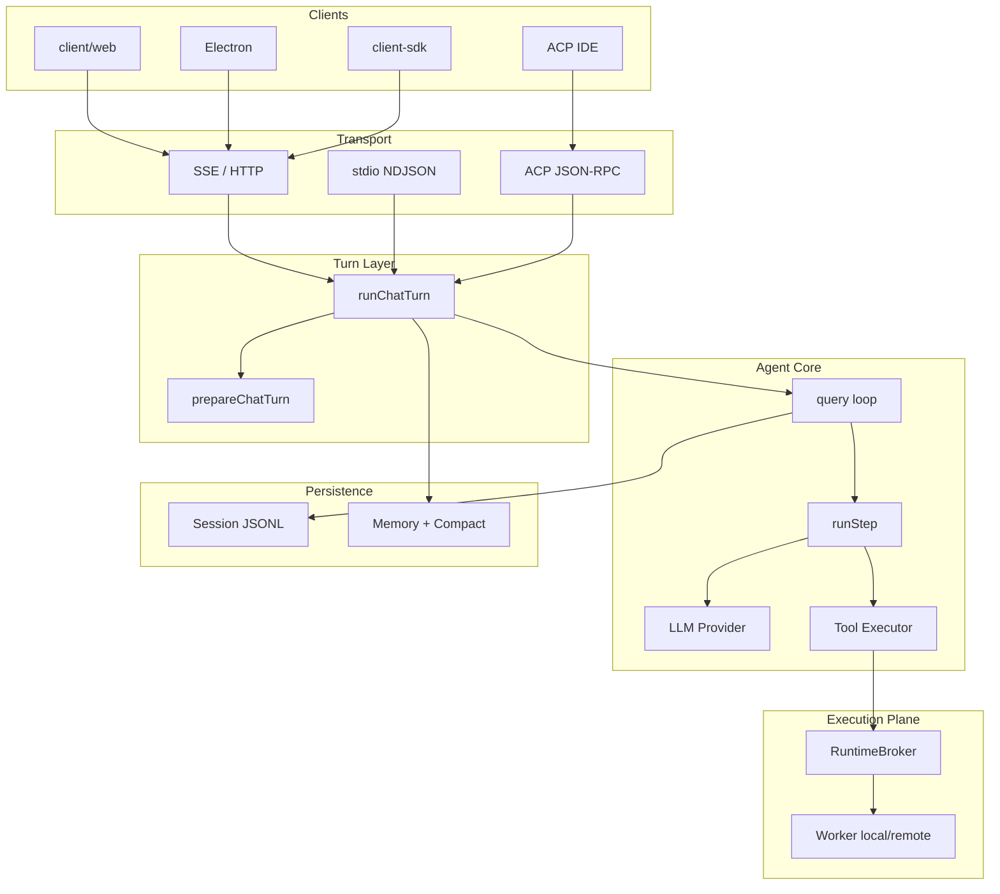

# Coding Agent System Architecture Overview

> A technical introduction for other engineering teams, based on the repository source code.
> Last verified against: `start.js`, `src/turn/run-chat-turn.ts`, `src/core/query.ts`, `src/server/router.ts`, and `protocol/`.

---

## 1. Product Positioning

**Coding Agent** (called Baize in some legacy repository references) is a locally runnable, self-hostable AI coding assistant. Its core capabilities include:

- Multi-turn conversations and tool calls (reading and editing files, running shell commands, search, LSP, browser automation, and more)
- Task decomposition through subagents (Explore, Plan, general-purpose, and custom agents)
- Extensibility through skills, MCP, and plugins
- Long-session context management (compaction, session memory, and auto memory)
- Execution in local and remote (SSH) workspaces
- Multiple entry points: Web UI, Electron desktop, stdio CLI, and ACP (VS Code, Cursor, and IntelliJ)

**Design principles reflected in the code structure:**

1. **Protocol first** — The engine is decoupled from the UI and transports. `protocol/` defines wire messages, `WireEmitter` emits them, and each transport only serializes them.
2. **Unified turn host** — HTTP `/chat`, the stdio CLI, and ACP all call `runChatTurn()`, avoiding three separate business-logic implementations.
3. **Separate execution and control planes** — The HTTP server is the control plane; file, shell, and LSP operations execute through Worker Runtime RPC, using the same architecture locally and over SSH.
4. **Layered configuration** — User, project, local, and managed settings support centrally distributed platform policies.

---

## 2. Repository Structure

```text
coding-agent/
├── start.js                 # Unified entry point: --acp | --stdio | HTTP by default
├── src/                     # Core agent engine
│   ├── entrypoints/cli.ts   # Mode dispatch
│   ├── server/              # HTTP server, routes, sessions, Workspace API
│   ├── turn/                # runChatTurn — transport-independent turn host
│   ├── core/                # Agent loop, LLM, settings, permissions, sandbox
│   ├── tools/               # Tool implementations (*Tool/ directories)
│   ├── services/            # Compaction, session memory, auto memory, LSP, tool execution
│   ├── execution/           # Execution control plane: local/SSH providers, RuntimeBroker
│   ├── worker/              # Worker process: FS, shell, LSP, rg
│   ├── acp/                 # Agent Client Protocol adapter
│   ├── cli/                 # stdio NDJSON CLI
│   ├── browser/             # Browser automation (Playwright + Chrome extension relay)
│   ├── skills/              # Skill loading and forking
│   ├── commands/            # Slash commands
│   ├── prompts/             # System prompts for modes and agent profiles
│   └── session/             # Session persistence (JSONL)
├── protocol/                # @ai-agent/protocol — wire protocol (Zod schemas)
├── client/web/              # React + Vite frontend
├── client-sdk/              # TypeScript HTTP client SDK
├── client-sdk-py/           # Python client SDK
├── electron/                # Desktop shell with embedded agent subprocess
├── deploy/                  # Docker deployment (admin / SSO)
├── analytics/               # Usage and cost analytics (optional deployment)
└── .ai-agent/               # Project-level skills, agents, commands, and settings
```

---

## 3. Runtime Modes

`start.js` → `src/entrypoints/cli.ts` selects a mode from `argv`:

| Mode | Start command | Communication | Purpose |
|------|---------------|---------------|---------|
| **HTTP** (default) | `npm start` | HTTP + SSE; `PORT` defaults to 4567 | Web UI, SDK, production deployment |
| **stdio** | `npm run cli` | stdin/stdout NDJSON | Script integration, headless operation |
| **ACP** | `npm run acp` | stdout JSON-RPC 2.0 | VS Code, Cursor, and IntelliJ |

In ACP mode, `console.log` and similar output are redirected to stderr so stdout contains only protocol messages.

When the HTTP server starts (`src/server/index.ts`), it also:

- Optionally serves static assets from `client/web/dist` (`SERVE_STATIC=0` runs a headless API only)
- Calls `bootstrapExecutionPlane()` to register local and SSH providers
- Calls `initBrowserLifecycle()` to initialize browser lifecycle management
- Cleans up the execution plane and LSP during graceful shutdown

---

## 4. End-to-End Architecture

```text
┌─────────────────────────────────────────────────────────────────────────┐
│  CLIENTS                                                                 │
│  ┌──────────────┐  ┌──────────────┐  ┌──────────────┐  ┌────────────┐ │
│  │ client/web   │  │ Electron     │  │ ACP Client   │  │ client-sdk │ │
│  │ React + SSE  │  │ embeds :4567 │  │ IDE extension│  │ HTTP API   │ │
│  └──────┬───────┘  └──────┬───────┘  └──────┬───────┘  └─────┬──────┘ │
└─────────┼─────────────────┼─────────────────┼────────────────┼────────┘
          │                 │                 │                │
          ▼                 ▼                 ▼                ▼
┌─────────────────────────────────────────────────────────────────────────┐
│  TRANSPORT LAYER                                                         │
│  HTTP/SSE (sse-transport)  │  stdio NDJSON  │  ACP JSON-RPC (acp/)      │
└─────────────────────────────────┬───────────────────────────────────────┘
                                  │ all call runChatTurn()
                                  ▼
┌─────────────────────────────────────────────────────────────────────────┐
│  TURN HOST — src/turn/run-chat-turn.ts                                   │
│  prepareChatTurn → runAgent(query) → persistence / wire events           │
└─────────────────────────────────┬───────────────────────────────────────┘
                                  ▼
┌─────────────────────────────────────────────────────────────────────────┐
│  AGENT LOOP — src/core/query.ts                                          │
│  for step: preTurn(compact) → runStep(LLM stream + tool execution) → …   │
└───────────────┬─────────────────────────────┬───────────────────────────┘
                │                             │
                ▼                             ▼
┌───────────────────────────┐   ┌───────────────────────────────────────────┐
│  LLM Provider            │   │  TOOLS + EXECUTION                         │
│  model-registry          │   │  ToolRegistry / assembleToolPool           │
│  large/medium/small      │   │  StreamingToolExecutor                     │
│  openai / anthropic /    │   │  → ExecutionBackend (Worker RPC)           │
│  openai-compatible       │   │     local Worker │ SSH remote Worker      │
└───────────────────────────┘   └───────────────────────────────────────────┘
                │
                ▼
┌─────────────────────────────────────────────────────────────────────────┐
│  PERSISTENCE & SIDE SERVICES                                             │
│  Session JSONL │ Compaction │ Session Memory │ Auto Memory │ Telemetry  │
└─────────────────────────────────────────────────────────────────────────┘
```

---

## 5. Wire Protocol (`protocol/`)

`@ai-agent/protocol` is the **single source of truth** shared by the engine and every GUI/client.

- **OutgoingMessage** (engine → client): `system/init`, `stream_event` (text/reasoning delta), `assistant`, `tool_call`, `tool_result`, `result`, `control_request`, and others
- **IncomingMessage** (client → engine): `user`, `control_response`, and others
- Every message includes envelope fields such as `session_id` and `uuid`
- `PROTOCOL_VERSION` is declared in the `system/init` handshake

Transport adapter responsibilities:

| Component | File | Responsibility |
|-----------|------|----------------|
| WireEmitter | `src/core/wire-emitter.ts` | Emit typed messages from the engine |
| SSE Transport | `src/server/sse-transport.ts` | HTTP streaming |
| stdio Transport | `src/server/stdio-transport.ts` | Line-delimited NDJSON protocol |
| ACP | `src/acp/` | Translate between JSON-RPC and wire messages |

---

## 6. Complete Conversation Flow

### 6.1 HTTP `/chat` Entry Point

`src/server/routes/chat.ts`：

1. Parse `message`, `session_id`, `workspace`, `mode`, `agentType`, and `environmentId`
2. Resolve or create the session and bind a `WorkspaceHandle` (`environmentId` + `cwd`)
3. Call `tryBeginTurn()` to prevent concurrent turns in the same session
4. Create an SSE transport or buffered JSON response
5. Call `runChatTurn({ ... runAgent })`

### 6.2 Turn Preparation — `prepareChatTurn`

`src/utils/processUserInput/prepare_chat_turn.ts`：

| Step | Description |
|------|-------------|
| Parse slash commands | `/help`, `/compact`, `/summary`, skill forks, and others |
| Load plugins | `loadPlugins(cwd)` — agents, skills, and MCP servers |
| Register subagents | `registerSubagents()` — built-in agents plus `.ai-agent/agents/` on disk |
| Register skills | `registerSkills()` — conditional activation |
| Load project rules | `loadAllAgentRules(cwd)` plus appended auto memory |
| Resolve ExecutionBackend | `resolveExecutionBackend(session)` — Worker RPC |
| Assemble tool pool | `assembleToolPool()` — active, deferred, and mode-specific tools |
| Build ToolUseContext | Sandbox, `readFileState`, middleware, and more |

For remote sessions (`ssh:*`), plugins, skills, and MCP configuration load from the control host's default workspace, while shell and file tools execute in the remote worker.

### 6.3 Turn Execution — `runChatTurn`

`src/turn/run-chat-turn.ts`：

1. `resolveSettings()` + `createModelRegistry()` — configure three model tiers
2. Handle mode changes, skill forks, manual compaction, and `/summary`
3. Emit `system/init` and `mode_changed` handshake messages
4. Register middleware for timing, plan-mode guards, and plugin hooks
5. Start memory prefetch for relevant auto memory
6. Call `runAgent()`, which invokes `query()`
7. Persist new messages with `appendMessage()` after the turn ends

### 6.4 Main Agent Loop — `query`

`src/core/query.ts` (aligned with Claude Code's `query()`):

```text
for step in 0..maxSteps:
  preTurn()          # compactIfNeeded before each step (micro/full compaction)
  runStep()          # one LLM round trip plus tool execution
  handle mode_changed / plan_ready and other events
  if step limit reached → forceFinalAnswerOnMaxSteps
```

### 6.5 Single-Step Execution — `runStep`

`src/core/query/run-step.ts`：

1. Sanitize messages, call `projectMessagesForApi`, and apply cache control
2. Call the LLM through `streamText()` using the `ai` SDK and provider strategy
3. Execute tool calls concurrently with `StreamingToolExecutor`
4. Call `buildToolMessage()` for **dual-path results**: the LLM sees a compact text projection, while the UI/wire path can receive complete blocks
5. Use reactive compaction or a transient retry when the context is too long

---

## 7. Tool System

### 7.1 Registration and Directory Conventions

- Global registry: `src/tools.ts` → `defaultRegistry`
- Each tool: `src/tools/FooTool/FooTool.ts` (`ToolDefinition`) + `prompt.ts`
- Runtime name references: `src/constants/tool_names.ts`

### 7.2 Built-in Tools (Registered Directly in `src/tools.ts`)

| Category | Tool Names |
|----------|------------|
| Shell | `Bash` (plus `PowerShell` on Windows) |
| Files | `Read`, `Write`, `Edit`, `Glob`, `Grep` |
| Tasks | `TaskOutput`, `TaskStop` (background Bash tasks) |
| Code intelligence | `LSP` |
| Web | `WebSearch`, `WebFetch` |
| Interaction | `AskUserQuestion`, `TodoWrite` |
| Browser | The `browser_*` family (about 20 tools) |
| Modes | `EnterPlanMode`, `ExitPlanMode` (injected by `assembleToolPool`) |

### 7.3 Dynamic Registration (Every Turn in `prepareChatTurn`)

| Source | Mechanism |
|--------|-----------|
| **Agent** | `AgentTool` — one `Agent` tool dispatches by `subagent_type` |
| **Skill** | `Skill` tool — loads SKILL.md content on demand |
| **MCP** | `mcp-lifecycle` — adds tools from stdio/SSE MCP servers to the registry |
| **Deferred** | Inactive tools enter the deferred pool and are activated on demand through `ToolSearch` |

`assembleToolPool()` (`src/tools/assembleToolPool.ts`) also handles:

- Permission-mode filtering (ask mode promotes read-only deferred tools)
- The main agent profile's `tools` allowlist and `disallowedTools` globs
- Promoting `browser_*` tools to active for the browser specialist, avoiding ToolSearch race conditions

### 7.4 Tool Execution

`src/services/tools/StreamingToolExecutor.ts` + `tool_execution.ts`：

- Concurrency policy: `buildConcurrencyPolicy()`
- Cancellation: `tool-abort-registry` (`POST /tool/abort`)
- Large-result persistence: `services/tool-storage/`
- Middleware hooks: `beforeTool` / `afterTool` (plan guard, timing, and plugins)

---

## 8. Subagents (Agent Tool)

Three are built in (`src/tools/AgentTool/built-in/`):

| agentType | Mode | modelTier | Typical Tools |
|-----------|------|-----------|---------------|
| `Explore` | Read-only | small | Read, Grep, Glob, Bash (read-only) |
| `Plan` | Read-only | large | Same tools plus a planning prompt |
| `general-purpose` | Read-write | large | Full tool set |

Extensions:

- On disk: `<workspace>/.ai-agent/agents/*.md` (frontmatter defines `tools`, `modelTier`, and `mode`)
- Plugins: bundled agent Markdown files
- Main-thread specialists: switch through `session.agentType` + `POST /session/agent`, replacing the system prompt

The `Agent` tool is implemented in `src/tools/AgentTool/AgentTool.ts`. Subagents run through `forked-agent` with an independent `query()` loop, and events are projected into the main-thread UI through `subagent-bus` / `subagent-wire`.

---

## 9. Skills, Commands, and Rules

| Mechanism | Path | Load Time |
|-----------|------|-----------|
| **Skills** | `.ai-agent/skills/*/SKILL.md` | `registerSkills()`, when candidate files match conditions |
| **Slash Commands** | `.ai-agent/commands/` | `dispatchSlashCommand()` |
| **Project Rules** | `AGENTS.md` / `CLAUDE.md` (merged upward from the git root to cwd) | `loadAllAgentRules()` |
| **User Rules** | `~/.ai-agent/AGENTS.md` | Same as above |
| **Plugins** | `.ai-agent/plugins/` | `loadPlugins()` — may contain agents, skills, and MCP configuration |

Ways to invoke a skill:

- Inline slash command: expand into the prompt
- Fork slash command: create an independent skill session (`respondSkillFork`)

---

## 10. Memory and Context Management

### 10.1 Four Memory Layers (Separation of Responsibilities)

| Layer | Implementation | Purpose |
|-------|----------------|---------|
| **Project Rules** | `rules-loader` | Inject into the system prompt every turn |
| **Auto Memory** | `services/auto-memory/` | Persist cross-session preferences in `.ai-agent/auto-memory/` |
| **Session Memory** | `services/session-memory/` | Per-session notes consumed during compaction |
| **Compaction** | `services/compact/` | Compress context (full, micro, reactive, and other modes) |

### 10.2 Compaction Triggers

- **Before every step**: `preTurn()` → `compactIfNeeded()`
- **Manual**: `/compact [instructions]`
- **At the end of a turn**: memory lifecycle hooks (`turn/memory-lifecycle.ts`)

### 10.3 Auto Memory Prefetch

When enabled, `runChatTurn` starts `startRelevantMemoryPrefetch()` before the main loop. A small model retrieves relevant memory fragments and injects them into the context.

---

## 11. LLM and Three Model Tiers

`src/core/llm/model-registry.ts`：

| Tier | Typical Uses |
|------|--------------|
| **large** | Main agent loop, planning, compaction |
| **medium** | Auto memory extraction (default) |
| **small** | Explore subagent, session titles, memory prefetch |

Provider strategies (`src/core/llm/strategies/`):

- `openai`
- `anthropic`
- `openai-compatible` (generic compatible endpoint)

Configuration: `models.large|medium|small` in `settings.json`, with fallback chain `small → medium → large`.

**No intelligent routing** — Each call site is statically bound to a `modelTier`, making costs predictable and debugging easier.

---

## 12. Permission Mode (Session Permission Mode)

`src/core/permission-mode.ts` defines three external modes:

| Mode | UX | Tool Restrictions |
|------|----|-------------------|
| `agent` | Full agent | Default tool set |
| `ask` | Read-only Q&A | Promote read-only deferred tools; block mutations |
| `plan` | Planning | Block file writes and mutating operations; `EnterPlanMode` / `ExitPlanMode` |

Switching entry points:

- The `mode` field in the request body
- `POST /session/mode`
- Plan approval: `POST /plan/approve` (`plan-approval-broker`)

---

## 13. Execution Plane

### 13.1 Control-Plane Components

Singletons initialized by `src/execution/bootstrap.ts`:

| Component | Responsibility |
|-----------|----------------|
| `EnvironmentRegistry` | Register local and SSH providers |
| `CredentialBroker` | Runtime authentication and AuthProxy |
| `RuntimeBroker` | Manage worker connections by `WorkspaceHandle` |
| `WorkspaceService` | Workspace binding semantics |
| `PermissionGateway` | Remote execution permissions |

### 13.2 Worker Runtime

`src/worker/main.ts` — a separate process using stdio NDJSON RPC:

- **FS**: `readText`, `writeText`, `listDir`, `stat`, and others
- **Shell**: foreground and background commands (`runShellCommand`)
- **LSP**: `lsp-host.ts` — language services run inside the worker
- **rg**: `run-rg.ts` — accelerated Grep

The control plane sends `fs_op` / `lsp_op` RPC messages through `WorkerExecutionBackend` (`worker-execution-backend.ts`).

### 13.3 Local vs Remote

| environmentId | Description |
|---------------|-------------|
| `local` | Local worker |
| `ssh:<host>` | The SSH provider starts an equivalent worker remotely |

Session binding: `session.workspace = { environmentId, cwd }`
Remote detection: `isRemoteWorkspace()` — `environmentId.startsWith('ssh:')`

---

## 14. HTTP Server API Overview

Main routes in `src/server/router.ts`:

| Method | Path | Description |
|--------|------|-------------|
| GET | `/health` | Health check |
| POST | `/chat` | Main chat endpoint (SSE or JSON) |
| POST | `/chat/cancel` | Cancel the current turn |
| POST | `/tool/abort` | Abort one tool or subagent |
| POST/GET/DELETE | `/sessions` | Session CRUD |
| GET | `/sessions/:id/messages` | Message history |
| GET/PATCH | `/settings` | Read and write settings |
| GET | `/mcp`, `/lsp` | MCP/LSP status |
| POST | `/session/mode`, `/session/agent` | Switch mode or specialist |
| POST | `/ask_user_question/answer` | Human-in-the-loop answers |
| POST | `/plan/approve` | Plan approval |
| * | `/workspace/*` | Workspace IDE file API |
| * | skills API | List and invoke skills |
| * | execution router | Connect remote environments and browse directories |

Authentication: when `AUTH_ENABLED=true`, JWT authorization gates access and isolates workspaces by user in SSO deployments.

---

## 15. Session Persistence

`src/session/store.ts`：

- In-memory `Map` plus on-disk **JSONL** (`SESSION_DIR`)
- Event types: `session_created`, `message`, `compaction`, `mode_change`, `agent_change`, and others
- **Turn mutex**: `tryBeginTurn` / `endTurn` prevent concurrent turns in one session
- `readFileState`: deduplicates Read calls and enables the `file_unchanged` optimization

---

## 16. Frontend (`client/web/`)

React + Vite + Zustand (`chat-store`):

| Module | Responsibility |
|--------|----------------|
| `ChatView` | Message stream and SSE consumption |
| `InputArea` | Input, @file references, and slash commands |
| `*Card.jsx` | UI cards for tool results |
| `WorkspaceIDE` | File tree and previews through the `/workspace` API |
| `BackgroundTerminals` | Background Bash task output |
| `BrowserLockBar` | Browser control handoff |

Development mode: `npm run dev:web` runs on port 5173 and proxies the API to port 4567.

---

## 17. Client SDKs and Integrations

| Package | Purpose |
|---------|---------|
| `client-sdk/` | `AgentClient` — streaming `chat()`, `listSkills()`, `invokeSkill()` |
| `client-sdk-py/` | Python bindings |
| ACP | IDE-side configuration using `npx tsx start.js --acp` |
| `analytics/` | Optional usage and cost backend |

---

## 18. Deployment Architecture

`deploy/` — the Web frontend and Coding Agent are **deployed separately**:

```text
browser ─┬─ load SPA ──▶ web (nginx static assets)
         └─ API calls ─▶ agent (headless :4567)
```

| Mode | Compose | Characteristics |
|------|---------|-----------------|
| admin | `docker-compose.admin.yml` | Web Basic Auth; Coding Agent on the internal network |
| sso | `docker-compose.sso.yml` | JWT; workspace isolation by user |

Managed policy layer: `/etc/ai-agent/` (skills, agents, and settings), with higher priority than user and project configuration.

---

## 19. Configuration Layers

`src/core/settings-manager.ts`：

| Scope | Path | Writable |
|-------|------|----------|
| user | `~/.ai-agent/settings.json` | ✓ |
| project | `<workspace>/.ai-agent/settings.json` | ✓ |
| local | `<workspace>/.ai-agent/settings.local.json` | ✓ |
| managed | `/etc/ai-agent/managed-settings.json` (+ drop-ins) | ✗ (platform-managed) |

Merged settings include `models`, `mcpServers`, `lspServers`, `compaction`, `sessionMemory`, `disabledTools`, `environments.ssh`, and more.

The directory name can be overridden with `AI_AGENT_DIR` (default: `.ai-agent`).

---

## 20. Extension Points for Other Teams

| Extension | Approach |
|-----------|----------|
| New tool | Implement `ToolDefinition` → register in `src/tools.ts` or a plugin |
| New LLM provider | Implement in `core/llm/strategies/` → register in `core/llm/index.ts` |
| New subagent | Add `.ai-agent/agents/*.md` or a plugin |
| Domain workflow | Add `.ai-agent/skills/*/SKILL.md` |
| External tool service | Configure `mcpServers` in `settings.json` |
| Custom IDE client | Implement ACP or consume `protocol` over stdio/SSE |
| Programmatic calls | Use the `client-sdk` HTTP API |
| Remote execution | Configure `environments.ssh` and the session `environmentId` |

---

## 21. Key Source Index

| Topic | Entry File |
|-------|------------|
| Startup and modes | `start.js` → `src/entrypoints/cli.ts` |
| HTTP routes | `src/server/router.ts` |
| Turn host | `src/turn/run-chat-turn.ts` |
| Turn preparation | `src/utils/processUserInput/prepare_chat_turn.ts` |
| Agent loop | `src/core/query.ts` |
| Single LLM step | `src/core/query/run-step.ts` |
| Tool registration | `src/tools.ts`, `src/tools/assembleToolPool.ts` |
| Subagents | `src/tools/AgentTool/` |
| Wire protocol | `protocol/src/wire.ts`, `protocol/src/server.ts` |
| Execution plane | `src/execution/bootstrap.ts` |
| Worker | `src/worker/main.ts` |
| Compaction | `src/services/compact/` |
| Memory | `src/services/session-memory/`, `src/services/auto-memory/` |
| ACP | `src/acp/main.ts` |
| Settings | `src/core/settings-manager.ts` |

---

## 22. Related Documentation

More detailed topical guides are available under `docs/` (most include illustrated HTML versions). See the index in [docs/dev/README.md](../dev/README.md):

- [coding-agent-architecture-guide.html](../dev/html/coding-agent-architecture-guide.html) — SVG architecture diagrams
- [three-tier-model-architecture.html](../dev/html/three-tier-model-architecture.html) — three model tiers
- [deferred-mcp-tools-skills-guide.html](../dev/html/deferred-mcp-tools-skills-guide.html) — Deferred / ToolSearch
- [session-compacting-guide.html](../dev/html/session-compacting-guide.html) — compaction
- [skill-loading-guide.html](../dev/html/skill-loading-guide.html) — skill loading
- [agent-memory-guide.md](../dev/memory/agent-memory-guide.md) — introduction to the memory system
- [agent-remote-execution-architecture.html](../dev/html/agent-remote-execution-architecture.html) — remote execution
- [deploy/README.md](../../deploy/README.md) — Docker deployment

---

## 23. Architecture Diagram (Mermaid)


