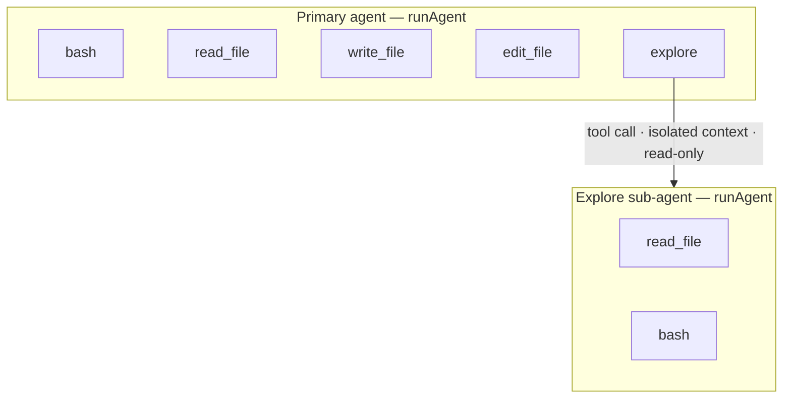
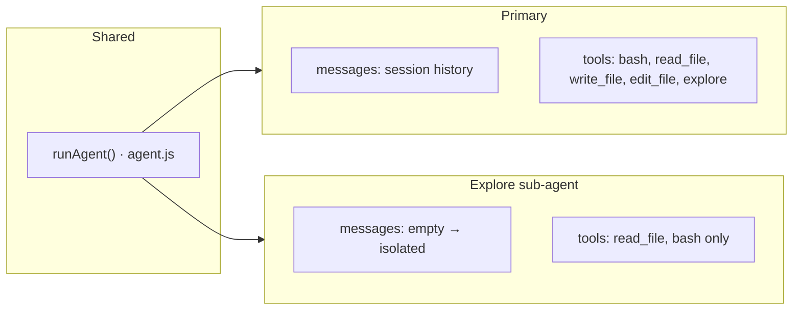
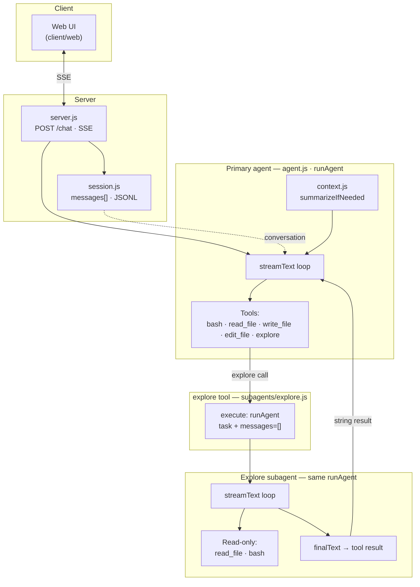
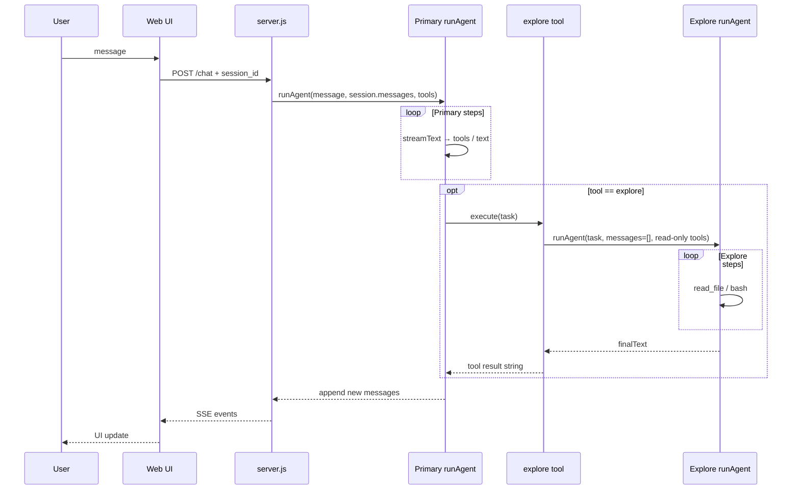
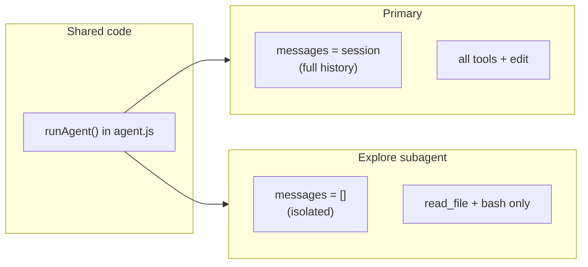

# 04-basic Architecture

Visual overview of how the **primary agent**, **explore subagent**, and **HTTP/session** layers fit together.

## Diagram (image) — agent & tools only

**Primary agent** holds five tools; **`explore`** is one of them and **starts** the **Explore sub-agent** (same `runAgent`, empty messages, read-only tools).

## Primary · tools · sub-agent (Mermaid)

关系与上图一致：**主代理**挂五个工具；**`explore`** 是其中一个工具，被调用时会启动 **Explore 子代理**（同一套 `runAgent`，独立 `messages`，只读工具）。

## Full stack: client → server → agents (Mermaid)

## Request / data flow (one chat turn)

## Same loop, two configurations

---

*Mermaid diagrams render on GitHub/GitLab and in many Markdown viewers. If your viewer does not support Mermaid, use the ASCII overview in [README.md](./README.md).*
